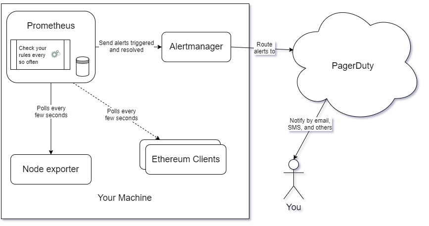

# Guide on how to do alerting for an Ethereum validator

Knowing when there is a potential problem with your machine or your processes is very good practice in IT. It can help you prevent major issues with your system. Alerting is the art of getting notified for when those issues are rising up. A common issue for which alerting is very useful and that many validators are likely to face is low remaining disk space because of the clients' databases growth and [the need to do some pruning](https://www.reddit.com/r/ethstaker/comments/n7mnx5/psa_if_youre_running_geth_prune/) to control that growth.

This guide is meant for people with no or little experience in alerting. This guide will show you step by step how to do alerting on your machine by giving you the instructions to install and configure all the tools needed. It will assume you are using a modern linux distribution with systemd and APT (like Ubuntu 20.04) on a modern x86 CPU (Intel, AMD). It will also use PagerDuty as a easy way to integrate with different messaging services (Email, SMS, Slack, etc) and to manage your incidents. If you do not currently use Prometheus with Node Exporter to monitor your system, you can use [my monitoring guide](monitoring.md) to install and configure those tools before using this guide.

A video tutorial of this guide can be seen on https://youtu.be/h2nrVZNofxc .

## Why would you want to do alerting?

Here are some good reasons why you might want to do alerting on your machine:

1. **Automatic issue detection**: You want to automatically check for issues with your system.
2. **Issue prevention**: You want to be able to find out about potential issues ahead of time.
3. **Issue notification**: You want to be automatically notified when there is an issue with your system.

## Overview

We will install 1 additional tool to your setup that should already be using Prometheus and Node Exporter: [Alertmanager](https://www.prometheus.io/docs/alerting/latest/alertmanager/). We will also be using [PagerDuty](https://www.pagerduty.com/use-cases/it-operations/) as our incident manager and as our tool to get notified. We will configure Prometheus to check for rules that might indicate a problem with your machine. When a rule is triggered or resolved, Prometheus will send that information to Alertmanage which will route it to PagerDuty.

**Prometheus** is an open-source systems monitoring project. It collects and stores different metrics in a specialized database. It can be configured to constantly verify that certain metrics are within our expected margins. In our setup, it will periodically check for rules and forward any unexpected result to Alertmanager.

**Alertmanager** is an open-source project that handles alerts sent by client applications such as Prometheus. In our setup, it will receive alerts that are triggered and resolved from Prometheus and it will route them to PagerDuty.

**PagerDuty** is a large online incident response platform. It can be used for a wide variety of incident management use cases. In our setup, it will receive alerts from Alertmanager and it will notify us when we have an incident with our machine. Optionally, it can be used to manage your incidents in greater detail.



## Setup an account on PagerDuty

Create an account on https://www.pagerduty.com/ . You can start with the free trial and migrate to the free plan when you are done with the trial.

When you eventually reach your Incidents dashboard, make sure to click on the initial test incident and manually resolve it. Click your first service and to go the Integrations tab. Click the *+ Add another integration* and choose *Events API V2*. Open up the *Events API V2* section and copy the value in the *Integration Key* field. We will need that API key in one configuration file below. It should look like a bunch of random letters and numbers.

There are many different ways of configuring PagerDuty to receive a notification when an incident occurs. Play around and check what is available. By default, you should receive an email. It might be interesting to add an SMS notification in there.

## Executing the commands

Almost all of these commands will be performed in a terminal. Start your *Terminal* application. Any line that starts with the dollar sign (`$`) is a command that need to be executed in your terminal. Do not input the dollar sign (`$`) in your terminal, only the text that comes after that.

Executing a command with `sudo` will occasionally ask you for your password. Make sure to enter your account password correctly. You can execute the command again if you fail to enter the correct password after a few attempts.

## Installing Alertmanager

These steps will install Alertmanager as a systemd service.

Create the alertmanager user.

```console
$ sudo useradd --no-create-home --shell /bin/false alertmanager
```

Create the configuration and data directories with proper ownership.

```console
$ sudo mkdir /etc/alertmanager
$ sudo mkdir /var/lib/alertmanager
$ sudo chown -R alertmanager:alertmanager /etc/alertmanager
$ sudo chown -R alertmanager:alertmanager /var/lib/alertmanager
```

Download the latest stable version of Alertmanager from https://prometheus.io/download/#alertmanager (avoid any pre-release version). As of this date, the latest version is 0.24.0 . Adjust the following instructions accordingly if there is a newer stable release version with a different archive name. The file name should end with *linux-amd64.tar.gz* (for linux and AMD64 instructions set).

```console
$ wget https://github.com/prometheus/alertmanager/releases/download/v0.25.0/alertmanager-0.25.0.linux-amd64.tar.gz
```

Verify that the SHA256 Checksum as shown on https://prometheus.io/download/#alertmanager is the same as the file we just downloaded.

```console
$ sha256sum alertmanager-0.25.0.linux-amd64.tar.gz
```

Extract the archive.

```console
$ tar xvf alertmanager-0.25.0.linux-amd64.tar.gz
```

Copy the binaries to the following locations and set ownership.

```console
$ sudo cp alertmanager-0.25.0.linux-amd64/alertmanager /usr/local/bin/
$ sudo cp alertmanager-0.25.0.linux-amd64/amtool /usr/local/bin/
$ sudo chown alertmanager:alertmanager /usr/local/bin/alertmanager
$ sudo chown alertmanager:alertmanager /usr/local/bin/amtool
```

Remove the download leftovers.

```console
$ rm -rf alertmanager-0.25.0.linux-amd64
$ rm alertmanager-0.25.0.linux-amd64.tar.gz
```

Setup the Alertmanager configuration file. Open the YAML config file for editing.

```console
$ sudo nano /etc/alertmanager/alertmanager.yml
```

Paste the following into the file taking care to **replace the placeholder PagerDuty API key by your real API key** created in the *Setup an account on PagerDuty* section above (the `<` and `>` characters at the start and at the end of the placeholder should be removed). Exit and save the file.

```yaml
route:
  group_by: ['alertname']
  group_wait: 30s
  group_interval: 5m
  repeat_interval: 1h
  receiver: 'pagerduty'

receivers:
- name: 'pagerduty'
  pagerduty_configs:
  - routing_key: <PagerDuty API key>

inhibit_rules:
  - source_match:
      severity: 'critical'
    target_match:
      severity: 'warning'
    equal: ['alertname', 'dev', 'instance']
```

Set ownership for the config file.

```console
$ sudo chown alertmanager:alertmanager /etc/alertmanager/alertmanager.yml
```

Setup the Alertmanager systemd service. Open the service definition file.

```console
$ sudo nano /etc/systemd/system/alertmanager.service
```

Paste the following into the file. Exit and save the file.

```ini
[Unit]
Description=Alertmanager
Wants=network-online.target
After=network-online.target

[Service]
Type=simple
User=alertmanager
Group=alertmanager
Restart=always
RestartSec=5
ExecStart=/usr/local/bin/alertmanager \
    --config.file /etc/alertmanager/alertmanager.yml \
    --storage.path /var/lib/alertmanager/ \
    --web.listen-address="localhost:9093" \
    --cluster.listen-address=""
ExecReload=/bin/kill -HUP $MAINPID

[Install]
WantedBy=multi-user.target
```

Reload systemd to reflect the changes.

```console
$ sudo systemctl daemon-reload
```

Start the service and check the status to make sure it's running correctly.

```console
$ sudo systemctl start alertmanager.service
$ sudo systemctl status alertmanager.service
```

Output should look something like this.

```
● alertmanager.service - Alertmanager
     Loaded: loaded (/etc/systemd/system/alertmanager.service; enabled; vendor >
     Active: active (running) since Mon 2021-07-12 22:12:06 UTC; 1s ago
   Main PID: 81779 (alertmanager)
      Tasks: 9 (limit: 18405)
     Memory: 22.3M
     CGroup: /system.slice/alertmanager.service
             └─81779 /usr/local/bin/alertmanager --config.file /etc/alertmanage>

Jul 12 22:12:06 testsystem systemd[1]: Started Alertmanager.
Jul 12 22:12:06 testsystem alertmanager[81779]: level=info ts=2021-07-12T22:1>
Jul 12 22:12:06 testsystem alertmanager[81779]: level=info ts=2021-07-12T22:1>
Jul 12 22:12:06 testsystem alertmanager[81779]: level=info ts=2021-07-12T22:1>
Jul 12 22:12:06 testsystem alertmanager[81779]: level=info ts=2021-07-12T22:1>
Jul 12 22:12:06 testsystem alertmanager[81779]: level=info ts=2021-07-12T22:1>
Jul 12 22:12:06 testsystem alertmanager[81779]: level=info ts=2021-07-12T22:1>
Jul 12 22:12:06 testsystem alertmanager[81779]: level=info ts=2021-07-12T22:1>
Jul 12 22:12:06 testsystem alertmanager[81779]: level=info ts=2021-07-12T22:1>
```

If you did everything right, it should say active (running) in green. If not then go back and repeat the steps to fix the problem. Press Q to quit.

Enable the Alertmanager service to start on boot.

```console
$ sudo systemctl enable alertmanager.service
```

## Configuring Prometheus to use Alertmanager

Edit your prometheus configuration file. It's likely in `/etc/prometheus/prometheus.yml`. If not, adjust accordingly.

```console
$ sudo nano /etc/prometheus/prometheus.yml
```

Make sure you have the following sections in that configuration file. You might already have part of it in comments. If so, just remove the related comments and paste this in there. This section is often located before the `scrape_configs` section.

```yaml
alerting:
  alertmanagers:
  - static_configs:
    - targets:
      - localhost:9093

rule_files:
  - "alert_rules.yml"
```

## Adding alerting rules

Setup the rules for alerting. Open the rules file.

```console
# sudo nano /etc/prometheus/alert_rules.yml
```

Paste the following base rules into the file. Exit and save the file.

```yaml
groups:
- name: alert_rules
  rules:
  - alert: Available_disk_space_too_low
    expr: node_filesystem_avail_bytes{mountpoint="/"} <= 81920000000
    for: 1m
    labels:
      severity: critical
    annotations:
      summary: Available disk space below 80GB
  - alert: Available_memory_too_low
    expr: node_memory_MemAvailable_bytes <= 1024000000
    for: 1m
    labels:
      severity: critical
    annotations:
      summary: Available memory below 1GB
  - alert: CPU_usage_too_high
    expr: 100 - (avg by (instance) (irate(node_cpu_seconds_total{mode="idle"}[5m])) * 100) >= 90
    for: 5m
    labels:
      severity: critical
    annotations:
      summary: CPU usage above 90%
```

This base rules file has 3 rules which you can adjust by modifying the `expr` field's value.

1. The first rule will alert you when you have less than around 80GB (81920000000 bytes) of available disk space on your `/` mount continuously for 1 minute. If your filesystem and your partitions are configured in a different way where you want to check for a different mount, you will have to change that `expr` field. If you have direct access to your prometheus web interface (often at `http://<machine ip>:9090`), you can execute the `node_filesystem_avail_bytes` query to view all possible mounts and their current free space. You can also view your current mounts and their free space by running the `$ df -h` command.
2. The second rule will alert you when you have less than around 1GB (1024000000 bytes) of free RAM to be used by your processes continuously for 1 minute. If your machine is consistently using almost all of your available RAM, you might want to lower that 1GB (1024000000 bytes) threshold value in that `expr` field.
3. The third rule will alert you when your CPU cores are used for more than 90% of their processing power continuously for 5 minutes.

Set ownership for the config file. If your prometheus service is running under an account that is not `prometheus`, adjust accordingly.

```console
$ sudo chown prometheus:prometheus /etc/prometheus/alert_rules.yml
```

Restart your prometheus service and check the status to make sure it's running correctly. If your prometheus service is not configured to run using systemd with the `prometheus.service` name, adjust accordingly.

```console
$ sudo systemctl restart prometheus.service
$ sudo systemctl status prometheus.service
```

Output should look something like this.

```
● prometheus.service - Prometheus
     Loaded: loaded (/etc/systemd/system/prometheus.service; enabled; vendor pr>
     Active: active (running) since Tue 2021-07-13 01:36:01 UTC; 6s ago
   Main PID: 83685 (prometheus)
      Tasks: 12 (limit: 18405)
     Memory: 125.4M
     CGroup: /system.slice/prometheus.service
             └─83685 /usr/local/bin/prometheus --config.file /etc/prometheus/pr>

Jul 13 01:36:01 testsystem prometheus[83685]: level=info ts=2021-07-13T01:36:>
Jul 13 01:36:02 testsystem prometheus[83685]: level=info ts=2021-07-13T01:36:>
Jul 13 01:36:02 testsystem prometheus[83685]: level=info ts=2021-07-13T01:36:>
Jul 13 01:36:02 testsystem prometheus[83685]: level=info ts=2021-07-13T01:36:>
Jul 13 01:36:02 testsystem prometheus[83685]: level=info ts=2021-07-13T01:36:>
Jul 13 01:36:02 testsystem prometheus[83685]: level=info ts=2021-07-13T01:36:>
Jul 13 01:36:02 testsystem prometheus[83685]: level=info ts=2021-07-13T01:36:>
Jul 13 01:36:02 testsystem prometheus[83685]: level=info ts=2021-07-13T01:36:>
Jul 13 01:36:02 testsystem prometheus[83685]: level=info ts=2021-07-13T01:36:>
Jul 13 01:36:02 testsystem prometheus[83685]: level=info ts=2021-07-13T01:36:>
```

If you did everything right, it should say active (running) in green. If not then go back and repeat the steps to fix the problem. Press Q to quit.

## Testing your rules

Time to test some of these rules.

### Available disk space test

Here is an example to test your *Available disk space* rule. First, check how much space you have left on your disk.

```console
$ df -h
```

You should see something like this.

```
Filesystem                         Size  Used Avail Use% Mounted on
udev                               7.5G     0  7.5G   0% /dev
tmpfs                              1.6G  1.7M  1.6G   1% /run
/dev/mapper/ubuntu--vg-ubuntu--lv  915G  438G  431G  51% /
tmpfs                              7.6G     0  7.6G   0% /dev/shm
tmpfs                              5.0M     0  5.0M   0% /run/lock
tmpfs                              7.6G     0  7.6G   0% /sys/fs/cgroup
/dev/nvme0n1p2                     976M  108M  801M  12% /boot
/dev/nvme0n1p1                     511M  7.9M  504M   2% /boot/efi
/dev/loop1                          56M   56M     0 100% /snap/core18/1944
/dev/loop0                         100M  100M     0 100% /snap/core/11316
/dev/loop2                         9.2M  9.2M     0 100% /snap/canonical-livepatch/99
/dev/loop3                          32M   32M     0 100% /snap/snapd/10707
/dev/loop4                          70M   70M     0 100% /snap/lxd/19188
/dev/loop5                          33M   33M     0 100% /snap/snapd/12398
/dev/loop6                          68M   68M     0 100% /snap/lxd/20326
/dev/loop7                          56M   56M     0 100% /snap/core18/2074
tmpfs                              1.6G     0  1.6G   0% /run/user/1000
```

Here, we can see that the main mount is `/`. It has around 431GB of available disk space. If you want to test the 80GB limit we set in the alerting rules, we can create a dummy file that is 400GB in size with this command.

```console
$ fallocate -l 400G largespacer.img
```

That will leave us only around 31GB of available disk space. Waiting around 2 minutes should trigger an incident on PagerDuty and you should receive an email with the alert details.

Once your *Available disk space* test is done, you can remove the dummy file with this command.

```console
$ rm largespacer.img
```

### Available memory test

Here is an example to test your *Available memory* rule. Make sure your incident is resolved on PagerDuty first if you just tested your *Available disk space* rule.

Check how much memory you have available.

```console
$ free -kh
```

You should see something like this.

```
              total        used        free      shared  buff/cache   available
Mem:           15Gi       5.5Gi       334Mi       0.0Ki       9.3Gi       9.3Gi
Swap:         4.0Gi       114Mi       3.9Gi
```

You should check the available column in this output. In this example, we have about 9.3GB of available RAM. We can use the following command to start a dummy process that will use around 8.8GB of memory to reach our less than around 1GB of free RAM threshold.

```console
$ </dev/zero head -c 8800m | tail
```

Trying to consume RAM with a dummy process like that can be tricky because of how the operating system manages free memory. If you fail to trigger your rule, try to slowly increment the amount of memory consumed with a new dummy process. This should leave us around 500MB of free RAM. Waiting around 2 minutes should trigger an incident on PagerDuty and you should receive an email with the alert details.

Once your *Available memory* test is done, you can terminate the dummy process that is needlessly consuming your memory by typing `CTRL`+`C` in your terminal.

## Resolving the incidents

Once the alert is resolved, Alertmanager will call PagerDuty and it should automatically resolve the incident within a few minutes. You can manually acknowledge and resolve any incident on your PagerDuty Incidents dashboard.

That's it. That should give you some good alerting foundation. There is a lot more you can do with such setup but we will leave that as an exercise to the reader.

## Security risks

Adding and using Alertmanager, Prometheus and PagerDuty with this configuration comes with a few additional security risks for your system.

The first risk comes from the tools themselves. There might be some security issues with them that I am not aware of which might compromise your machine to some malicious actors. A great way to prevent such risk is to keep your system updated.

Keeping Prometheus and Alertmanager updated will require some efforts. You will need to monitor new stable releases and whether they include severe or critical bug fixes. To update to a new version, you will need to download the latest stable release, extract the archive, copy the binaries to their expected location and restart these services. The process and the instructions to download the new version, extract the archive and copy the binaries is exactly the same one mentioned at the beginning of the [Installing Alertmanager](#installing-alertmanager) section. You can find the same related section for Prometheus [on my monitoring guide](monitoring.md#installing-prometheus). Easy to use script that do all those steps for you are [included below](#alertmanager-update-scripts).

To restart the Alertmanager service after you updated its binary, use this command.

```console
$ sudo systemctl restart alertmanager.service
```

To restart the Prometheus service after you updated its binary, use this command.

```console
$ sudo systemctl restart prometheus.service
```

You can find all the Prometheus releases and their changelog on https://github.com/prometheus/prometheus/releases. You can find all the Alertmanager releases and their changelog on https://github.com/prometheus/alertmanager/releases.

You might never need to update these tools as there might not be any severe or critical issue with them or there might not be an issue that can be easily exploited by a malicious actor with the version you have. However, it's a good practice to monitor releases for the tools you are using and update them regularly.

There might be some risks associated with using PagerDuty. You should contact them and reach their support if you are concerned about the risks associated with that platform.

The second risk comes from the additional attack surface that these tools are creating. One of this attack surface is the HTTP server it is adding and the port on which it is listening. This guide configured Alertmanager to only listen on your localhost interface meaning that it cannot be accessed from any other machine on a network. You would have to have malicious processes or actors connecting to Alertmanager from your machine to trigger a false alert for instance. A good way to prevent this risk is to limit the running processes, run only trusted processes, limit who can connect to the machine and only allow trusted people connecting to your machine.

There might be other kind of risks associated with those tools and this configuration, but I think these two are the main ones.

### Alertmanager update scripts

I created a simple script to ease the pain of updating Alertmanager. You can find it in this repository: [update-alertmanager.py](scripts/update-alertmanager.py). This script will check the current installed version and it will compare it with the latest stable release version on Github. If there is a new version available, it will prompt you to update it. This script require a somewhat recent version of Python 3 which should already be installed on your system.

You can easily download this script with:

```console
$ wget https://raw.githubusercontent.com/eth-educators/ethstaker-guides/main/scripts/update-alertmanager.py
```

To run the Alertmanager update script, use this command:

```console
$ python3 update-alertmanager.py
```

## Support

If you have any question or if you need additional support, make sure to get in touch with the ethstaker community on:

* Discord: [discord.io/ethstaker](https://discord.io/ethstaker)
* Reddit: [reddit.com/r/ethstaker](https://www.reddit.com/r/ethstaker/)

## Credits

Based on [Somer Esat's guide](https://github.com/SomerEsat/ethereum-staking-guide).
