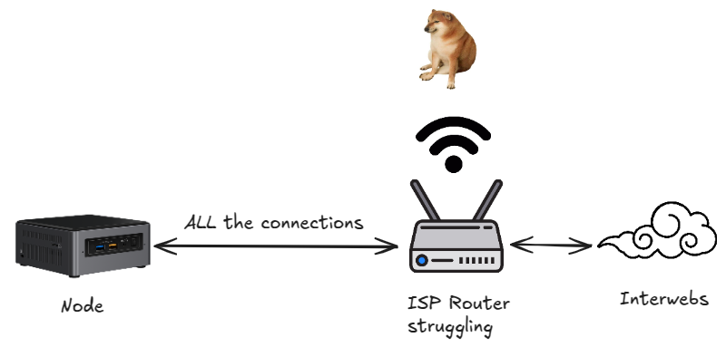

# The Problem

When running an Ethereum node at home, the ISP's router may "buckle" under the sheer number of connections your node creates.

The symptom for this is typically that Internet access slows to a crawl or fails entirely, but recovers for a while when the
route is rebooted, and/or the Ethereum node is shut off.

*Above: Typical scenario with undersized ISP router*

# The Solution

Place the ISP's router into "bridge mode", and run your own router. The ISP's router in bridge mode no longer understands
IP addresses, does not provide WiFi, and generally has no clue what a "connection" is.

Your own router handles connections and WiFi, and will handle the Ethereum node with ease.

The ISP's router is kept in the setup so that the ISP has a clear "demarc" - Demarcation Point - and will continue to
provide good support for issues with the line. This also simplifies setup.

## Which home router?

Most home routers in the USD 200+ range should do great. Two models are particularly well liked, the
[Netgear RS line](https://www.netgear.com/home/wifi/routers/listing-filter/ax-wifi7/), and the
[Ubiquity Dream Machine Pro](https://techspecs.ui.com/unifi/unifi-cloud-gateways/udm-pro).

We've documented Netgear, and are interested in receiving screen shots and a walk-through for Ubiquity. If you're feeling helpful, get in touch on
[Ethstaker Discord](https://discord.gg/ethstaker)

> Caution: The Ubiquity Dream Router [reportedly](https://www.reddit.com/r/Ubiquiti/comments/126pi7q/dream_router_with_xfinity_gateway_doesnt_work/)
does not work well, and cannot handle GBit Internet. If you have one on Comcast in bridge mode, and it works for you, please get in touch so we can
document it, including minimum firmware version, any specific settings to make it work, and throughput restrictions.

## Do all ISPs support bridge mode?

Not all ISPs do.

We've tested successfully on:

- Comcast (USA)
- NOS (Portugal)

These ISPs do not have bridge mode, or "true bridge mode":

- AT&T Fiber (USA). A community solution is to use an Ubiquity Dream Machine Pro, a
[custom fiber transceiver](https://pon.wiki/guides/masquerade-as-the-att-inc-bgw320-500-505-on-xgs-pon-with-the-bfw-solutions-was-110/),
and for WiFi, Ubiquity APs. If you have this working or are interested in getting it to work, please get in touch.
