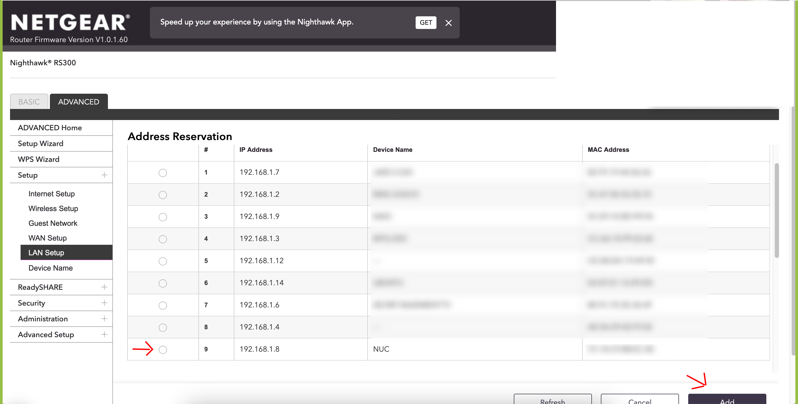
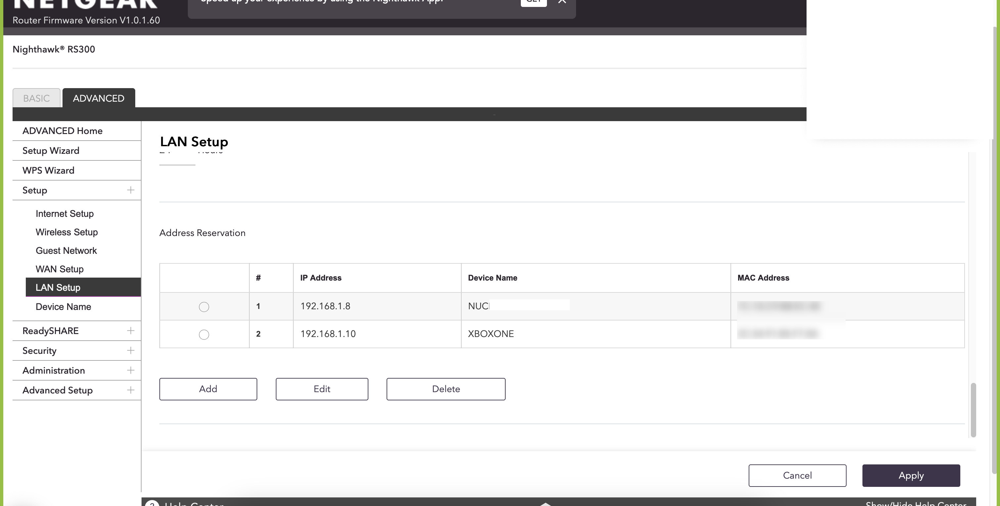
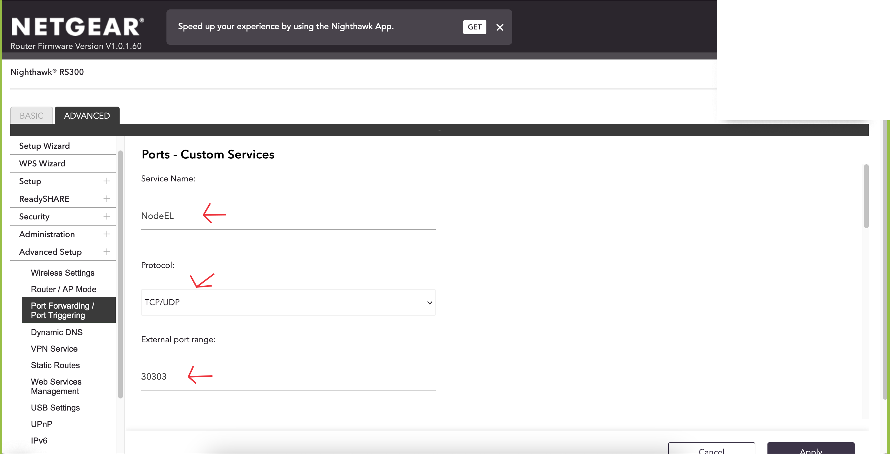
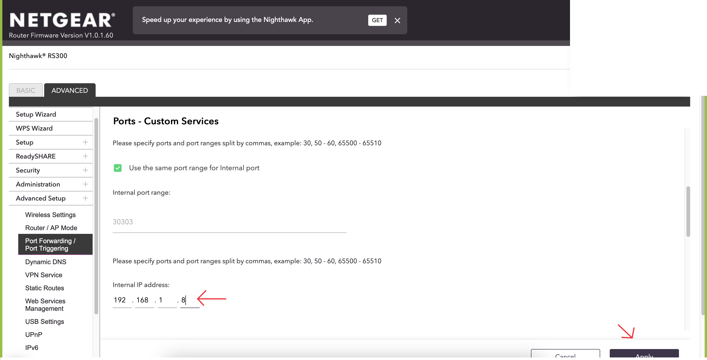
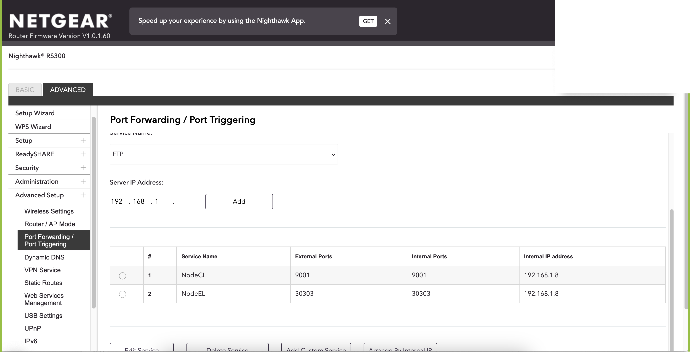

# Netgear RS Port Forwarding Setup

With the initial setup, you have functioning WiFi and LAN. Any port forwards aren't set up yet, though, and
that impacts both your Ethereum node and any gaming consoles. So let's take those additional steps.

## WiFi

If you did not configure the original WiFi SSID - network name - and password during initial RS setup, do
so now. Netgear have [instructions](https://kb.netgear.com/23439/How-do-I-change-my-NETGEAR-router-s-WiFi-password-or-network-name-SSID).

## DHCP Reservation

This step assumes that all devices that need an unchanging IP address for port forwarding - your
Ethereum node, your gaming console(s), anything else - use a DHCP reservation, not a static IP.

If it's a static IP configured on the device, you may need to change it there, if the internal network
address changes on Netgear, vs. what your ISP router runs.

Connect your Ethereum node to a LAN port - local network port - on the Netgear RS, so it gets an
IP address from there and we can set up a reservation. One of the 2.5G ports is a good choice.

In the Netgear web interface, go to Advanced -> Setup -> LAN Setup, and under "Address Reservation",
click the Selection radio button to the left of your node entry, then click "Add".

If you don't see your node there, it didn't get an IP address from the Netgear RS. Is it maybe using
a static IP? In that case, you'd set the static IP to something that's in the `192.168.1.0/24` range
of the Netgear RS, and change the DHCP range of the Netgear RS to exclude that static IP.

*Above: Add the DHCP Reservation*

Repeat this for any other devices in your network that had a "DHCP Reservation".

Once added, "Apply" the changes and see that they were successful.

*Above: DHCP Reservation successful*

## Port Forwarding

Next, let's configure port forwarding for your node, any gaming consoles, and any other port
forwarding settings you recorded. When in doubt, check the current configuration of your
ISP router once more.

- Go to Advanced -> Advanced Setup -> Port Forwarding / Port Triggering.
- Leave the service type as "Port Forwarding".
- Click on "Add Custom Service"
- Give the port forwarding a name
- Set the "Protocol", for example "TCP/UDP" for Ethereum nodes. Prysm is special however,
and you may have different TCP and UDP ports. Watch out for that.
- Set the "External port range" to what you had jotted down. Common defaults are `9000`
for a consensus layer client, or `9001` if using RocketPool. And `30303` for an execution
layer client.
- "Use the same port range for Internal port" should be checked
- "Internal IP address" is the address you reserved for your node in the previous step
- Click "Apply"

*Above: Port Forwarding Settings up to External port range

*Above: The rest of the Port Forwarding Settings
 

*Above: Port Forwarding successfully set up, here for a RocketPool node*

Repeat this for any other port forwardings you may have configured in your network,
on your current ISP router.
