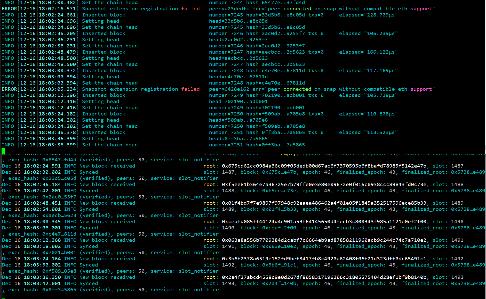
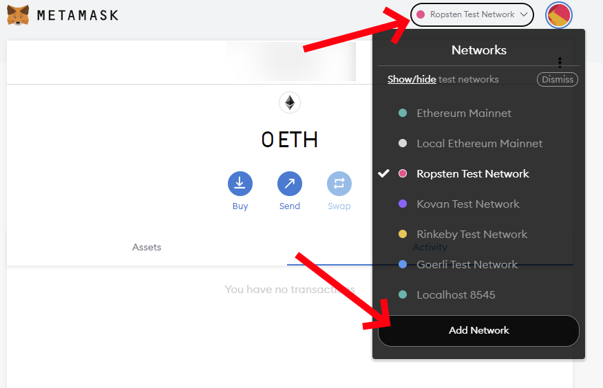
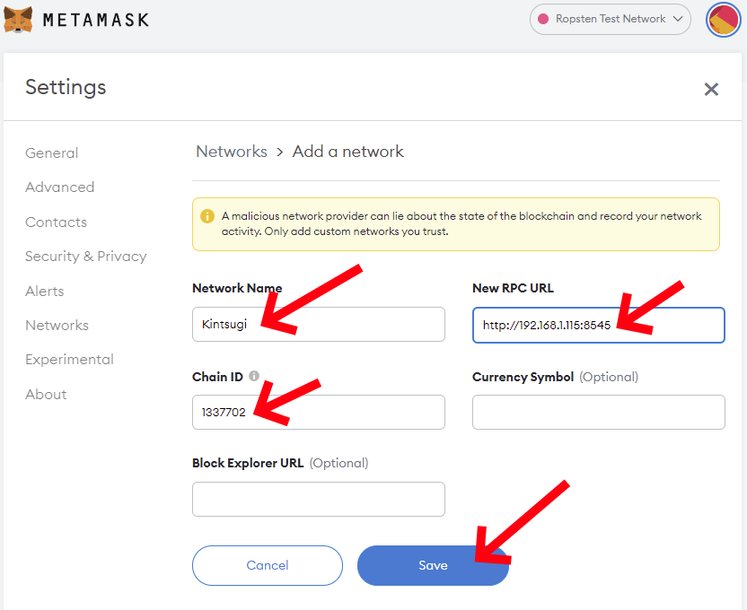
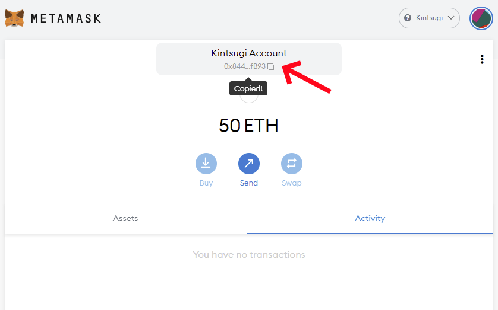
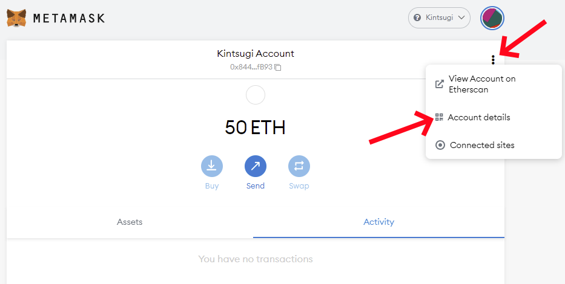
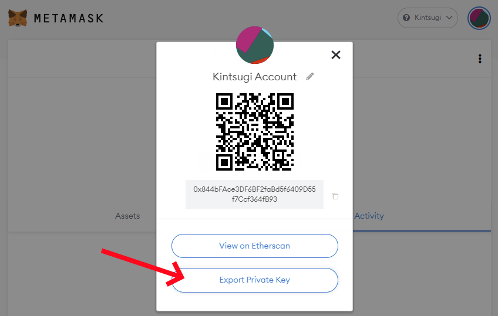
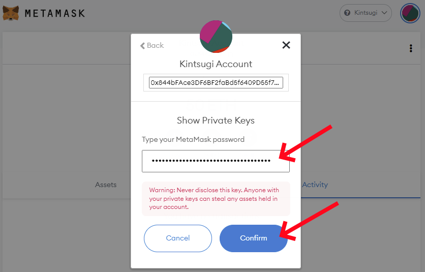
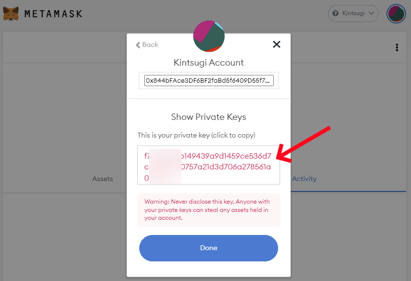

# Guide on how to join the Kintsugi testnet

[*#TestingTheMerge*](https://twitter.com/search?q=%23TestingTheMerge) is an Ethereum community initiative to test [the merge upgrade](https://ethereum.org/en/eth2/merge/) with various testnets. It is being spear headed by [Marius van der Wijden](https://twitter.com/vdWijden) and [Parithosh Jayanthi](https://twitter.com/parithosh_j). It is meant to test the recent experimental features added to various Ethereum clients supporting this protocol upgrade.

This guide is meant for people with little or some experience in running Ethereum clients and using the command-line interface (CLI). It will show you step by step how to setup your machine to join the *Kintsugi* testnet by giving you the instructions to install and configure all the tools needed. It will assume you are using a modern linux distribution with systemd and APT (like Ubuntu 20.04, but it should work on most recent debian derivatives) on a modern x86 CPU (Intel, AMD). A clean install of your operating system on a dedicated machine or a virtual machine before proceeding is preferable.

A video tutorial of this guide can be seen on https://youtu.be/r31aeGPoy1o .

## Overview

We will build special versions of Geth and Lighthouse and we will configure them to connect to the *Kintsugi* testnet.

## Executing the commands

Almost all of these commands will be performed in a terminal. Start your *Terminal* application. Any line that starts with the dollar sign (`$`) is a command that need to be executed in your terminal. Do not input the dollar sign (`$`) in your terminal, only the text that comes after that.

Executing a command with `sudo` will occasionally ask you for your password. Make sure to enter your account password correctly. You can execute the command again if you fail to enter the correct password after a few attempts.

## Installing Prerequisites

Make sure we have fully updated packages first.

```console
$ sudo apt -y update
$ sudo apt -y upgrade
```

Install prerequisites commonly available.

```console
$ sudo apt -y install git build-essential cmake wget curl ccze jq
```

Install a recent version of go.

```console
$ wget https://go.dev/dl/go1.17.5.linux-amd64.tar.gz
$ sudo rm -rf /usr/local/go && sudo tar -C /usr/local -xzf go1.17.5.linux-amd64.tar.gz
$ export PATH=$PATH:/usr/local/go/bin
$ echo 'PATH="$PATH:/usr/local/go/bin"' >> ~/.profile
$ rm go1.17.5.linux-amd64.tar.gz
```

Install a recent version of rust.

```console
$ curl https://sh.rustup.rs -sSf | sh
```

Type `1` and `Enter` to select option 1 *Proceed with installation (default)*.

Add the rust toolchains to your path.

```console
$ source $HOME/.cargo/env
```

## Building and Installing Geth merge-kintsugi

Clone Marius van der Wijden's Geth repository and switch to the `merge-kintsugi` branch.

```console
$ cd ~
$ git clone -b merge-kintsugi https://github.com/MariusVanDerWijden/go-ethereum.git
```

Build this special Geth version.

```console
$ cd go-ethereum
$ make geth
```

Wait for building to finish and install this special Geth version globally.

```console
$ sudo cp ./build/bin/geth /usr/local/bin
$ cd ~
```

## Building and Installing Lighthouse unstable

Clone the official Lighthouse repository and switch to the `unstable` branch.

```console
$ cd ~
$ git clone -b unstable https://github.com/sigp/lighthouse.git
```

Build this special Lighthouse version.

```console
$ cd lighthouse
$ make
```

Wait for building to finish and install this special Lighthouse version globally.

```console
$ sudo cp ~/.cargo/bin/lighthouse /usr/local/bin
$ cd ~
```

## Obtaining the testnet configuration files

Clone Parithosh Jayanthi's testnet files repository.

```console
$ cd ~
$ git clone https://github.com/parithosh/consensus-deployment-ansible.git
```

## Initializing and configuring your Geth node

Create a dedicated user for running Geth, create a directory for holding the data and assign the proper permissions.

```console
$ sudo useradd --no-create-home --shell /bin/false goeth
$ sudo mkdir -p /var/lib/goethereum
$ sudo chown -R goeth:goeth /var/lib/goethereum
```

Initialize your Geth node with the *Kintsugi* genesis file.

```console
$ sudo -u goeth /usr/local/bin/geth \
    init ~/consensus-deployment-ansible/kintsugi-testnet/custom_config_data/genesis.json \
    --datadir /var/lib/goethereum
```

Create a systemd service config file to configure the Geth node service.

```console
$ sudo nano /etc/systemd/system/geth.service
```

Paste the following service configuration into the file. Exit and save once done (`Ctrl` + `X`, `Y`, `Enter`).

```ini
[Unit]
Description=Go Ethereum Client - Geth (1337702)
After=network.target
Wants=network.target

[Service]
User=goeth
Group=goeth
Type=simple
Restart=always
RestartSec=5
ExecStart=/usr/local/bin/geth \
    --cache 2048 \
    --syncmode=full \
    --http \
    --datadir /var/lib/goethereum \
    --metrics \
    --metrics.expensive \
    --pprof \
    --networkid=1337702 \
    --catalyst \
    --http.api="engine,eth,web3,net,debug" \
    --http.corsdomain "*" \
    --http.addr "0.0.0.0"

[Install]
WantedBy=default.target
```

Reload systemd to reflect the changes and start the service. Check status to make sure it’s running correctly.

```console
$ sudo systemctl daemon-reload
$ sudo systemctl start geth.service
$ sudo systemctl status geth.service
```

It should say active (running) in green text. If not then go back and repeat the steps to fix the problem. Press Q to quit (will not affect the geth service).

Enable the geth service to automatically start on reboot.

```console
$ sudo systemctl enable geth.service
```

You can watch the live messages from your Geth node logs using this command.

```console
$ sudo journalctl -f -u geth.service -o cat | ccze -A
```

Press `Ctrl` + `C` to stop showing those messages.

## Configuring your Lighthouse beacon node

Create a dedicated user for running the Lighthouse beacon node, create a directory for holding the data, copy testnet files and assign the proper permissions.

```console
$ sudo useradd --no-create-home --shell /bin/false lighthousebeacon
$ sudo mkdir -p /var/lib/lighthouse
$ sudo cp -r ~/consensus-deployment-ansible/kintsugi-testnet /var/lib/lighthouse
$ sudo chown -R lighthousebeacon:lighthousebeacon /var/lib/lighthouse
```

Create a systemd service config file to configure the Lighthouse beacon node service.

```console
$ sudo nano /etc/systemd/system/lighthousebeacon.service
```

Paste the following service configuration into the file. Exit and save once done (`Ctrl` + `X`, `Y`, `Enter`).

```ini
[Unit]
Description=Lighthouse Ethereum Client Beacon Node (Kintsugi)
Wants=network-online.target
After=network-online.target

[Service]
Type=simple
User=lighthousebeacon
Group=lighthousebeacon
Restart=always
RestartSec=5
ExecStart=/usr/local/bin/lighthouse bn \
    --spec mainnet \
    --datadir /var/lib/lighthouse \
    --staking \
    --http-allow-sync-stalled \
    --merge \
    --execution-endpoints http://127.0.0.1:8545 \
    --metrics \
    --validator-monitor-auto \
    --boot-nodes="enr:-Iq4QKuNB_wHmWon7hv5HntHiSsyE1a6cUTK1aT7xDSU_hNTLW3R4mowUboCsqYoh1kN9v3ZoSu_WuvW9Aw0tQ0Dxv6GAXxQ7Nv5gmlkgnY0gmlwhLKAlv6Jc2VjcDI1NmsxoQK6S-Cii_KmfFdUJL2TANL3ksaKUnNXvTCv1tLwXs0QgIN1ZHCCIyk" \
    --testnet-dir /var/lib/lighthouse/kintsugi-testnet/custom_config_data

[Install]
WantedBy=multi-user.target
```

Reload systemd to reflect the changes and start the service. Check status to make sure it’s running correctly.

```console
$ sudo systemctl daemon-reload
$ sudo systemctl start lighthousebeacon.service
$ sudo systemctl status lighthousebeacon.service
```

It should say active (running) in green text. If not then go back and repeat the steps to fix the problem. Press Q to quit (will not affect the Lighthouse beacon node service).

Enable the Lighthouse beacon node service to automatically start on reboot.

```console
$ sudo systemctl enable lighthousebeacon.service
```

You can watch the live messages from your Lighthouse beacon node logs using this command.

```console
$ sudo journalctl -f -u lighthousebeacon.service -o cat | ccze -A
```

Press `Ctrl` + `C` to stop showing those messages.

## Monitoring your syncing status

If everything went right, you should see similar logs from your Geth node service and your Lighthouse beacon node service.



You can also confirm you are at the head by comparing with [a public blockchain explorer](https://beaconchain.kintsugi.themerge.dev/). The latest slot number should match what you see in your Lighthouse beacon node logs.

## Trying the Kintsugi testnet and performing transactions

### Adding Kintsugi to MetaMask

Now that you have a Geth node, you can use it to add the *Kintsugi* testnet in your MetaMask networks and try a few transactions. You will need your machine IP address, the one on which you installed and configured your Geth node, to configure this new network in MetaMask. In the end, you will need the full RPC URL.

* If you are on the same machine (your Geth node is running on the same machine as your browser with the MetaMask extension), use: `localhost`, The RPC URL in that case would be: `http://localhost:8545`.
* If you are on a local network (your Geth node is running on a separate dedicated machine or virtual machine on your local network), use: the IP address of that machine on your local network. You can type `ip address` to find out that IP address. It often starts with `192.168` for machine on your local network. If you see something like `inet 192.168.1.115/24` with that command, it means the IP address is `192.168.1.115`. The RPC URL in that case would be `http://192.168.1.115:8545`.
* If your machine is running remotely on a VPS, in the cloud or some third party hosting, it might be somewhat dangerous to expose the port to your Geth node (8545), but you could configure your firewall to expose it and connect to that public IP address. The RPC URL would be something like: `http://<publicIP>:8545` where `<publicIP>` is replaced with the public IP of your machine.
* If you really don't know how to get that machine IP address, you can use a public endpoint like `https://rpc.kintsugi.themerge.dev/`.

In MetaMask, click on network dropdown list and click the `Add Network` button.



Fill out those fields:

* **Network Name**: Kintsugi
* **New RPC URL**: The RPC URL to your machine Geth endpoint or a public endpoint (see above on how to find out your RPC URL with your machine IP address)
* **Chain ID**: 1337702

And click on the `Save` button.



It should switch to that new network by default. If not, select the `Kintsugi` in the network dropdown list.

### Requesting testnet funds

Go to [the public faucet](https://faucet.kintsugi.themerge.dev/), request some funds and wait for them to appear in your MetaMask wallet. Don't use a known wallet address for this. Create a temporary account if you need one. The faucet is known to fail once in a while. If you see any error when requesting, try again in a few minutes. It should eventually work.

### Performing a simple transaction on Kintsugi

With the `Kintsugi` network selected in MetaMask and some funds in your wallet, you should now be able to perform transactions on this testnet. Try sending some of those funds to another wallet. Check [the transactions explorer](https://explorer.kintsugi.themerge.dev/) to see if it worked.

## Adding a validator

You will need to funds [from the faucet first](https://faucet.kintsugi.themerge.dev/) in a regular MetaMask account if you did not get some yet. Do not use real ETH or a known wallet address for this. Make sure you are using a new regular account in MetaMask for all of this.

### Creating your validator keys and performing the deposit

Install eth2-val-tools and ethereal.

```console
$ go install github.com/protolambda/eth2-val-tools@latest
$ go install github.com/wealdtech/ethereal@latest
```

That last command can take a few minutes. Please be patient.

Setup PATH for these new tools.

```console
$ export PATH=$PATH:~/go/bin
$ echo 'PATH="$PATH:~/go/bin"' >> ~/.profile
```

Generate 2 mnemonics with these commands. Take note of those mnemonics somewhere. We will need them later on.

```console
$ eth2-val-tools mnemonic && echo
$ eth2-val-tools mnemonic && echo
```

Next, we need your MetaMask account **wallet address** and **private key**. Make sure you have a wallet address with at least 32 Kintsugi ETH or more (it's a little more than 32 actually if you account for the gas fees). If you do not have such a wallet address in MetaMask, [request some testnet funds first](#requesting-testnet-funds).

Getting your wallet address is as easy as clicking on the account at the top in MetaMask. It will be copied to your clipboard. Take note of your wallet address. We will need it later on.



To access your account private key, you need to click on the 3 dots on the right side of your account name and click on *Account details*.



Click on the *Export Private Key* button.



Enter your MetaMask password and click on the *Confirm* button.



Your private key will be shown. Copy and paste it somewhere and take note of your private key. We will need it in the next step.



Create a new file called `secrets.env`. This file will contain everything we need to generate your deposit data, your keystore and perform the deposit using your MetaMask account.

```console
$ cd ~
$ nano secrets.env
```

Paste the following initial values into the file. 

```bash
# sets the deposit amount to use
DEPOSIT_AMOUNT=32000000000
# sets the genesis fork version of the testnet
FORK_VERSION="0x60000069"
# sets the mnemonic to derive the keys from
VALIDATORS_MNEMONIC=""
# sets the mnemonic for withdrawal credentials
WITHDRAWALS_MNEMONIC=""
# temporary location to store the deposit data
DEPOSIT_DATAS_FILE_LOCATION="/tmp/deposit_data.txt"
# sets the deposit contract address
DEPOSIT_CONTRACT_ADDRESS="0x4242424242424242424242424242424242424242"
# sets the eth1 address from which the transaction will be made
ETH1_FROM_ADDR=""
# sets the eth1 private key used to sign the transaction
ETH1_FROM_PRIV=""
# forces the deposit since the deposit contract will not be recognized by the tool
FORCE_DEPOSIT=true
# sets an RPC endpoint to submit the transaction to
ETH1_RPC=https://rpc.kintsugi.themerge.dev
```

There are 4 fields you need to fill with the values we created above:

* **VALIDATORS_MNEMONIC**: Enter one of the mnemonic you created in there. Make sure to keep the starting and ending double quote before and after your value.
* **WITHDRAWALS_MNEMONIC**: Enter the second mnemonic you created in there. Make sure to keep the starting and ending double quote before and after your value.
* **ETH1_FROM_ADDR**: Enter your wallet address from MetaMask. It should start with `0x`. Make sure to keep the starting and ending double quote before and after your value.
* **ETH1_FROM_PRIV**: Enter your account private key from MetaMask. You will need to add `0x` in front of your value. Make sure to keep the starting and ending double quote before and after your value.

It should end up looking like this (don't use those values, they will not work for you, they are simply meant to show you what your `secrets.env` file will look like in the end).

```bash
# sets the deposit amount to use
DEPOSIT_AMOUNT=32000000000
# sets the genesis fork version of the testnet
FORK_VERSION="0x60000069"
# sets the mnemonic to derive the keys from
VALIDATORS_MNEMONIC="negative grab siege canyon ask exact opinion void season acquire case tray urban bachelor wash ring jump adjust green capital march biology gaze enrich"
# sets the mnemonic for withdrawal credentials
WITHDRAWALS_MNEMONIC="pencil improve galaxy void source icon habit noodle version slide media cause game grief summer indicate forget modify desert badge assist bamboo ignore live"
# temporary location to store the deposit data
DEPOSIT_DATAS_FILE_LOCATION="/tmp/deposit_data.txt"
# sets the deposit contract address
DEPOSIT_CONTRACT_ADDRESS="0x4242424242424242424242424242424242424242"
# sets the eth1 address from which the transaction will be made
ETH1_FROM_ADDR="0x844bFAce3DF6BF2faBd5f6409D55f7Ccf364fB93"
# sets the eth1 private key used to sign the transaction
ETH1_FROM_PRIV="0xf75581af4b149439a9d1459ce536d7c8ab9a780757a21d3d706a278561a0478e"
# forces the deposit since the deposit contract will not be recognized by the tool
FORCE_DEPOSIT=true
# sets an RPC endpoint to submit the transaction to
ETH1_RPC=https://rpc.kintsugi.themerge.dev
```

Exit and save once done (`Ctrl` + `X`, `Y`, `Enter`).

Create a new file called `devnet_deposits.sh`.

```console
$ cd ~
$ nano devnet_deposits.sh
```

Paste the following script into the file. Exit and save once done (`Ctrl` + `X`, `Y`, `Enter`).

```bash
#!/bin/bash

echo "USE AT YOUR OWN RISK"
read -p "Are you sure you've double checked the values and want to make this deposit? " -n 1 -r
echo
if [[ ! $REPLY =~ ^[Yy]$ ]]
then
    [[ "$0" = "$BASH_SOURCE" ]] && exit 1 || return 1
fi

source secrets.env

if [[ -z "${ETH1_FROM_ADDR}" ]]; then
  echo "need ETH1_FROM_ADDR environment var"
  exit 1 || return 1
fi
if [[ -z "${ETH1_FROM_PRIV}" ]]; then
  echo "need ETH1_FROM_PRIV environment var"
  exit 1 || return 1
fi


eth2-val-tools keystores \
  --source-min=0 \
  --source-max=1 \
  --source-mnemonic="$VALIDATORS_MNEMONIC"


eth2-val-tools deposit-data \
  --source-min=0 \
  --source-max=1 \
  --amount=$DEPOSIT_AMOUNT \
  --fork-version=$FORK_VERSION \
  --withdrawals-mnemonic="$WITHDRAWALS_MNEMONIC" \
  --validators-mnemonic="$VALIDATORS_MNEMONIC" > $DEPOSIT_DATAS_FILE_LOCATION.txt


# Iterate through lines, each is a json of the deposit data and some metadata
while read x; do
   account_name="$(echo "$x" | jq '.account')"
   pubkey="$(echo "$x" | jq '.pubkey')"
   echo "Sending deposit for validator $account_name $pubkey"
   ethereal beacon deposit \
      --allow-unknown-contract=$FORCE_DEPOSIT \
      --address="$DEPOSIT_CONTRACT_ADDRESS" \
      --connection=$ETH1_RPC \
      --data="$x" \
      --value="$DEPOSIT_ACTUAL_VALUE" \
      --from="$ETH1_FROM_ADDR" \
      --privatekey="$ETH1_FROM_PRIV"
   echo "Sent deposit for validator $account_name $pubkey"
   sleep 3
done < "$DEPOSIT_DATAS_FILE_LOCATION.txt"
```

Make this new script executable and run it to generate your keystore, your deposit data and perform the deposit.

```console
$ chmod +x devnet_deposits.sh
$ ./devnet_deposits.sh
```

Answer `y` at the first question and press `Enter`.

If everything went right, you should see something like this.

```console
USE AT YOUR OWN RISK
Are you sure you've double checked the values and want to make this deposit? y
Sending deposit for validator "m/12381/3600/0/0/0" "95b5d2e88616406d4ed48e0b2813d3cfef4b72970b3fc2461c4c510e3d903999075ea07e285a9b86141278310dda125b"
0xeb98ba862faffd60280e7aeef37055465bd7de90f23bf0bc09cc0fc0df071d5a
Sent deposit for validator "m/12381/3600/0/0/0" "95b5d2e88616406d4ed48e0b2813d3cfef4b72970b3fc2461c4c510e3d903999075ea07e285a9b86141278310dda125b"
```

The `95b5d2e88616406d4ed48e0b2813d3cfef4b72970b3fc2461c4c510e3d903999075ea07e285a9b86141278310dda125b` value here is the validator public key. Your own validator public key should be different.

You can check that your deposit transaction went through on [the transaction explorer](https://explorer.kintsugi.themerge.dev/address/0x4242424242424242424242424242424242424242/transactions).

### Configuring your Lighthouse validator client

Create a dedicated user for running the Lighthouse validator client, create a directory for holding the data and assign the proper permissions.

```console
$ sudo useradd --no-create-home --shell /bin/false lighthousevalidator
$ sudo mkdir -p /var/lib/lighthouse/validators
$ sudo chown -R lighthousevalidator:lighthousevalidator /var/lib/lighthouse/validators
$ sudo chmod 700 /var/lib/lighthouse/validators
```

The password to your keystore should be in a file located at `~/assigned_data/secrets/<pubkey>` where `<pubkey>` is replaced with the public key of your validator. Find out what is your keystore password before trying to import it. List the file that contains your keystore password and show its content on screen.

```console
$ ls ~/assigned_data/secrets
$ cat ~/assigned_data/secrets/<pubkey> && echo
```

Take note of that keystore password. You will need it in the next step.

Import your keystore that includes your validator key for the Lighthouse validator client. Running the first command will prompt you for that keystore password. Make sure to enter it correctly and avoid leaving it blank.

```console
$ sudo /usr/local/bin/lighthouse account validator import \
    --directory ~/assigned_data/keys \
    --datadir /var/lib/lighthouse \
    --testnet-dir /var/lib/lighthouse/kintsugi-testnet/custom_config_data
$ sudo chown -R lighthousevalidator:lighthousevalidator /var/lib/lighthouse/validators
```

Create a systemd service config file to configure the Lighthouse validator client service.

```console
$ sudo nano /etc/systemd/system/lighthousevalidator.service
```

Paste the following service configuration into the file. Exit and save once done (`Ctrl` + `X`, `Y`, `Enter`).

```ini
[Unit]
Description=Lighthouse Ethereum Client Validator Client (Kintsugi)
Wants=network-online.target
After=network-online.target

[Service]
User=lighthousevalidator
Group=lighthousevalidator
Type=simple
Restart=always
RestartSec=5
ExecStart=/usr/local/bin/lighthouse vc \
    --testnet-dir /var/lib/lighthouse/kintsugi-testnet/custom_config_data \
    --datadir /var/lib/lighthouse \
    --metrics

[Install]
WantedBy=multi-user.target
```

Reload systemd to reflect the changes and start the service. Check status to make sure it’s running correctly.

```console
$ sudo systemctl daemon-reload
$ sudo systemctl start lighthousevalidator.service
$ sudo systemctl status lighthousevalidator.service
```

It should say active (running) in green text. If not then go back and repeat the steps to fix the problem. Press Q to quit (will not affect the Lighthouse validator client service).

Enable the Lighthouse validator client service to automatically start on reboot.

```console
$ sudo systemctl enable lighthousevalidator.service
```

You can watch the live messages from your Lighthouse validator client logs using this command.

```console
$ sudo journalctl -f -u lighthousevalidator.service -o cat | ccze -A
```

Press `Ctrl` + `C` to stop showing those messages.

## What's next?

You performs a lot of different tasks to help with the [*#TestingTheMerge*](https://twitter.com/search?q=%23TestingTheMerge) initiave. Check out [the program structure](https://hackmd.io/WKpg6SNzQbi1jVKNgrSgWg). There are different tasks for all technical abilities.

## Good references

Check out [the Kintsugi website](https://kintsugi.themerge.dev/) for some good references to explorers and faucets.

## Support

If you have any question or if you need additional support, make sure to get in touch with people involved with this initiative:

* EthStaker Discord: [discord.io/ethstaker](https://discord.io/ethstaker) in the #testingthemerge🐼 channel
* Eth R&D Discord: [discord.gg/qGpsxSA](https://discord.gg/qGpsxSA) in the #testing channel under the *Merge* category.

## Credits

Based on [Somer Esat's guide](https://github.com/SomerEsat/ethereum-staking-guide).
Based on [Marius van der Wijden's guide](https://hackmd.io/dFzKxB3ISWO8juUqPpJFfw).
