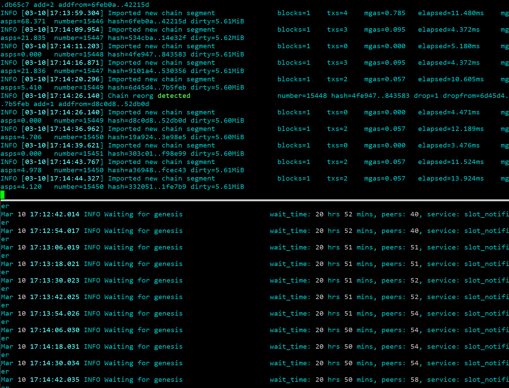

# Guide on how to join the Kiln testnet

[*#TestingTheMerge*](https://twitter.com/search?q=%23TestingTheMerge) is an Ethereum community initiative to test [the merge upgrade](https://ethereum.org/en/eth2/merge/) with various testnets. It is being spear headed by [Marius van der Wijden](https://twitter.com/vdWijden) and [Parithosh Jayanthi](https://twitter.com/parithosh_j). It is meant to test the recent experimental features added to various Ethereum clients supporting this protocol upgrade.

This guide is meant for people with little or some experience in running Ethereum clients and using the command-line interface (CLI). It will show you step by step how to setup your machine to join the *Kiln* testnet by giving you the instructions to install and configure all the tools needed. It will assume you are using a modern linux distribution with systemd and APT (like Ubuntu 20.04, but it should work on most recent debian derivatives) on a modern x86 CPU (Intel, AMD). A clean install of your operating system on a dedicated machine or a virtual machine before proceeding is preferable.

An video tutorial of this guide can be seen on https://youtu.be/caaV4oMmWe8

## Overview

We will build special versions of Geth and Lighthouse and we will configure them to connect to the *Kiln* testnet.

## Executing the commands

Almost all of these commands will be performed in a terminal. Start your *Terminal* application. Any line that starts with the dollar sign (`$`) is a command that need to be executed in your terminal. Do not input the dollar sign (`$`) in your terminal, only the text that comes after that.

Executing a command with `sudo` will occasionally ask you for your password. Make sure to enter your account password correctly. You can execute the command again if you fail to enter the correct password after a few attempts.

## Installing Prerequisites

Make sure we have fully updated packages first.

```console
$ sudo apt -y update
$ sudo apt -y upgrade
```

Install prerequisites commonly available.

```console
$ sudo apt -y install git build-essential pkg-config cmake clang wget curl ccze
```

Install a recent version of Go.

```console
$ wget https://go.dev/dl/go1.17.8.linux-amd64.tar.gz
$ sudo rm -rf /usr/local/go && sudo tar -C /usr/local -xzf go1.17.8.linux-amd64.tar.gz
$ export PATH=$PATH:/usr/local/go/bin
$ echo 'PATH="$PATH:/usr/local/go/bin"' >> ~/.profile
$ rm go1.17.8.linux-amd64.tar.gz
```

Install a recent version of Rust.

```console
$ curl https://sh.rustup.rs -sSf | sh
```

Type `1` and `Enter` to select option 1 *Proceed with installation (default)*.

Add the Rust toolchains to your PATH.

```console
$ source $HOME/.cargo/env
```

## Building and Installing Geth merge-kiln-v2

Clone Marius van der Wijden's Geth repository and switch to the `merge-kiln-v2` branch.

```console
$ cd ~
$ git clone -b merge-kiln-v2 https://github.com/MariusVanDerWijden/go-ethereum.git
```

Build this special Geth version.

```console
$ cd go-ethereum
$ make geth
```

Wait for building to finish and install this special Geth version globally.

```console
$ sudo cp ./build/bin/geth /usr/local/bin
$ cd ~
```

## Building and Installing Lighthouse unstable

Clone the official Lighthouse repository and switch to the `unstable` branch.

```console
$ cd ~
$ git clone -b unstable https://github.com/sigp/lighthouse.git
```

Build this special Lighthouse version.

```console
$ cd lighthouse
$ make
```

Wait for building to finish and install this special Lighthouse version globally.

```console
$ sudo cp ~/.cargo/bin/lighthouse /usr/local/bin
$ cd ~
```

## Obtaining the testnet configuration files

Clone eth-clients's merge testnets repository.

```console
$ cd ~
$ git clone https://github.com/eth-clients/merge-testnets.git
```

## Initializing and configuring your Geth node

Create a dedicated user for running Geth, create a directory for holding the data and assign the proper permissions.

```console
$ sudo useradd --no-create-home --shell /bin/false goeth
$ sudo mkdir -p /var/lib/goethereum
$ sudo cp ~/merge-testnets/kiln/genesis.json /var/lib/goethereum/
$ sudo chown -R goeth:goeth /var/lib/goethereum
```

Initialize your Geth node with the *Kiln* genesis file.

```console
$ sudo -u goeth /usr/local/bin/geth \
    init /var/lib/goethereum/genesis.json \
    --datadir /var/lib/goethereum
```

Create a systemd service config file to configure the Geth node service.

```console
$ sudo nano /etc/systemd/system/geth.service
```

Paste the following service configuration into the file. Exit and save once done (`Ctrl` + `X`, `Y`, `Enter`).

```ini
[Unit]
Description=Go Ethereum Client - Geth (1337802)
After=network.target
Wants=network.target

[Service]
User=goeth
Group=goeth
Type=simple
Restart=always
RestartSec=5
TimeoutStopSec=180
ExecStart=/usr/local/bin/geth \
    --syncmode=full \
    --http \
    --datadir /var/lib/goethereum \
    --metrics \
    --metrics.expensive \
    --pprof \
    --networkid=1337802 \
    --http.api="engine,eth,web3,net,debug" \
    --http.corsdomain "*" \
    --http.addr "0.0.0.0" \
    --authrpc.jwtsecret=/var/lib/goethereum/jwtsecret \
    --override.terminaltotaldifficulty 20000000000000 \
    --bootnodes "enode://c354db99124f0faf677ff0e75c3cbbd568b2febc186af664e0c51ac435609badedc67a18a63adb64dacc1780a28dcefebfc29b83fd1a3f4aa3c0eb161364cf94@164.92.130.5:30303"

[Install]
WantedBy=default.target
```

Reload systemd to reflect the changes and start the service. Check status to make sure it’s running correctly.

```console
$ sudo systemctl daemon-reload
$ sudo systemctl start geth.service
$ sudo systemctl status geth.service
```

It should say active (running) in green text. If not then go back and repeat the steps to fix the problem. Press Q to quit (will not affect the geth service).

Enable the geth service to automatically start on reboot.

```console
$ sudo systemctl enable geth.service
```

You can watch the live messages from your Geth node logs using this command.

```console
$ sudo journalctl -f -u geth.service -o cat | ccze -A
```

Press `Ctrl` + `C` to stop showing those messages.

## Configuring your Lighthouse beacon node

Create a dedicated user for running the Lighthouse beacon node, create a directory for holding the data, copy testnet files and assign the proper permissions.

```console
$ sudo useradd --no-create-home --shell /bin/false lighthousebeacon
$ sudo mkdir -p /var/lib/lighthouse
$ sudo chown -R lighthousebeacon:lighthousebeacon /var/lib/lighthouse
```

Create a systemd service config file to configure the Lighthouse beacon node service.

```console
$ sudo nano /etc/systemd/system/lighthousebeacon.service
```

Paste the following service configuration into the file. Exit and save once done (`Ctrl` + `X`, `Y`, `Enter`).

```ini
[Unit]
Description=Lighthouse Ethereum Client Beacon Node (Kiln)
Wants=network-online.target
After=network-online.target

[Service]
Type=simple
User=lighthousebeacon
Group=lighthousebeacon
Restart=always
RestartSec=5
ExecStart=/usr/local/bin/lighthouse bn \
    --network kiln \
    --datadir /var/lib/lighthouse \
    --staking \
    --http-allow-sync-stalled \
    --merge \
    --execution-endpoints http://127.0.0.1:8551 \
    --metrics \
    --validator-monitor-auto \
    --jwt-secrets="/var/lib/goethereum/jwtsecret" \
    --terminal-total-difficulty-override=20000000000000 \
    --boot-nodes="enr:-Iq4QMCTfIMXnow27baRUb35Q8iiFHSIDBJh6hQM5Axohhf4b6Kr_cOCu0htQ5WvVqKvFgY28893DHAg8gnBAXsAVqmGAX53x8JggmlkgnY0gmlwhLKAlv6Jc2VjcDI1NmsxoQK6S-Cii_KmfFdUJL2TANL3ksaKUnNXvTCv1tLwXs0QgIN1ZHCCIyk"

[Install]
WantedBy=multi-user.target
```

Make the JWT secret readable by all so our beacon node client can access it.

```console
$ sudo chmod +r /var/lib/goethereum/jwtsecret
```

Reload systemd to reflect the changes and start the service. Check status to make sure it’s running correctly.

```console
$ sudo systemctl daemon-reload
$ sudo systemctl start lighthousebeacon.service
$ sudo systemctl status lighthousebeacon.service
```

It should say active (running) in green text. If not then go back and repeat the steps to fix the problem. Press Q to quit (will not affect the Lighthouse beacon node service).

Enable the Lighthouse beacon node service to automatically start on reboot.

```console
$ sudo systemctl enable lighthousebeacon.service
```

You can watch the live messages from your Lighthouse beacon node logs using this command.

```console
$ sudo journalctl -f -u lighthousebeacon.service -o cat | ccze -A
```

Press `Ctrl` + `C` to stop showing those messages.

## Monitoring your syncing status

If everything went right, you should see similar logs from your Geth node service and your Lighthouse beacon node service.



You can also confirm you are at the head by comparing with [a public blockchain explorer](https://beaconchain.kiln.themerge.dev/). The latest slot number should match what you see in your Lighthouse beacon node logs.

## Trying the Kiln testnet and performing transactions

### Adding Kiln to MetaMask

If you just want to use the public RPC and make it easier on yourself, you can simply go to [the official Kiln website](https://kiln.themerge.dev/) and click on the *Add network to MetaMask* button. If you do, you can skip all of this section.

Now that you have a Geth node, you can use it to add the *Kiln* testnet in your [MetaMask](https://metamask.io/) networks and try a few transactions. You will need your machine IP address, the one on which you installed and configured your Geth node, to configure this new network in MetaMask. In the end, you will need the full RPC URL.

* If you are on the same machine (your Geth node is running on the same machine as your browser with the MetaMask extension), use: `localhost`, The RPC URL in that case would be: `http://localhost:8545`.
* If you are on a local network (your Geth node is running on a separate dedicated machine or virtual machine on your local network), use: the IP address of that machine on your local network. You can type `ip address` to find out that IP address. It often starts with `192.168` for machines on local networks. If you see something like `inet 192.168.1.115/24` with that command, it means the IP address is `192.168.1.115`. The RPC URL in that case would be `http://192.168.1.115:8545`.
* If your machine is running remotely on a VPS, in the cloud or on some third party hosting, it might be somewhat dangerous to expose the port to your Geth node (8545), but you could configure your firewall to expose it and connect to that public IP address. The RPC URL would be something like: `http://<publicIP>:8545` where `<publicIP>` is replaced with the public IP of your machine.
* If you really don't know how to get that machine IP address, you can use a public endpoint like `https://rpc.kiln.themerge.dev/` for your RPC URL.

In MetaMask, click on the network dropdown list and click the *Add Network* button.


Fill out those fields:

* **Network Name**: Kiln
* **New RPC URL**: The RPC URL to your machine Geth endpoint or a public endpoint (see above on how to find out your RPC URL with your machine IP address)
* **Chain ID**: 1337802

And click on the *Save* button.


It should switch to that new network by default. If not, select `Kiln` in the network dropdown list.

### Requesting testnet funds

Go to [the public faucet](https://faucet.kiln.themerge.dev/), request some funds and wait for them to appear in your MetaMask wallet. Don't use a known wallet address for this. Create a temporary account if you need one. The faucet is known to fail once in a while. If you see any error when requesting, try again in a few minutes. It should eventually work.

### Performing a simple transaction on Kiln

With the `Kiln` network selected in MetaMask and some funds in your wallet, you should now be able to perform transactions on this testnet. Try sending some of those funds to another wallet. Check [the transactions explorer](https://explorer.kiln.themerge.dev/) to see if it worked.

## Adding a validator

You will need funds [from the faucet](https://faucet.kiln.themerge.dev/) in a regular MetaMask account if you do not have some already. Do not use real ETH or a known wallet address for this. Make sure you are using a new regular account in MetaMask for all of this.

### Creating your validator keys and performing the deposit

There are 2 great tools to create your validator keys:

* GUI based: [Wagyu Key Gen](https://github.com/stake-house/wagyu-key-gen)
* CLI based: [staking-deposit-cli](https://github.com/ethereum/eth2.0-deposit-cli) (previously known as eth2.0-deposit-cli)

If you choose the *Wagyu Key Gen* application, make sure to select the *Kiln* network and follow the instructions provided.

If you choose the *staking-deposit-cli* application, here is how to create your validator keys:

```console
$ cd ~
$ wget https://github.com/ethereum/eth2.0-deposit-cli/releases/download/v2.0.0/staking_deposit-cli-e2a7c94-linux-amd64.tar.gz
$ tar xvf staking_deposit-cli-e2a7c94-linux-amd64.tar.gz
$ cd staking_deposit-cli-e2a7c94-linux-amd64/
$ ./deposit new-mnemonic --num_validators 1 --chain kiln
$ ls -d $PWD/validator_keys/*
```

Make sure to store your keystore password and your mnemonic somewhere safe. You should end up with a deposit file (starts with `deposit_data-` and ends with `.json`) and one or more keystore files (starts with `keystore-` and ends with `.json`), 1 per validator. Copy them around if needed. Make sure your deposit file and your keystore files are in a known and accessible location on your machine.

Next we will do the deposit using the Kiln launchpad. Make sure you have access to a browser with MetaMask, your account with the funds from the faucet and the deposit file we just created.

Go to [the Kiln launchpad](https://kiln.launchpad.ethereum.org/en/). Follow the instructions, make sure *Kiln* is the selected network in MetaMask and use the deposit file to perform your deposit.

You can check that your deposit transaction went through on [the transaction explorer](https://explorer.kiln.themerge.dev/address/0x4242424242424242424242424242424242424242/transactions).

### Configuring your Lighthouse validator client

Create a dedicated user for running the Lighthouse validator client, create a directory for holding the data and assign the proper permissions.

```console
$ sudo useradd --no-create-home --shell /bin/false lighthousevalidator
$ sudo mkdir -p /var/lib/lighthouse/validators
$ sudo chown -R lighthousevalidator:lighthousevalidator /var/lib/lighthouse/validators
$ sudo chmod 700 /var/lib/lighthouse/validators
```

Import your keystore that includes your validator key for the Lighthouse validator client. Running the first command will prompt you for that keystore password. Make sure to enter it correctly and avoid leaving it blank. Make sure to replace `/path/to/keystores` with the actual path to your keystores created [in the previous step](#creating-your-validator-keys-and-performing-the-deposit).

```console
$ sudo /usr/local/bin/lighthouse account validator import \
    --directory /path/to/keystores \
    --datadir /var/lib/lighthouse \
    --network kiln
$ sudo chown -R lighthousevalidator:lighthousevalidator /var/lib/lighthouse/validators
```

Create a systemd service config file to configure the Lighthouse validator client service.

```console
$ sudo nano /etc/systemd/system/lighthousevalidator.service
```

Paste the following service configuration into the file. Exit and save once done (`Ctrl` + `X`, `Y`, `Enter`).

```ini
[Unit]
Description=Lighthouse Ethereum Client Validator Client (Kiln)
Wants=network-online.target
After=network-online.target

[Service]
User=lighthousevalidator
Group=lighthousevalidator
Type=simple
Restart=always
RestartSec=5
ExecStart=/usr/local/bin/lighthouse vc \
    --network kiln \
    --datadir /var/lib/lighthouse \
    --graffiti EthStaker \
    --metrics

[Install]
WantedBy=multi-user.target
```

Reload systemd to reflect the changes and start the service. Check status to make sure it’s running correctly.

```console
$ sudo systemctl daemon-reload
$ sudo systemctl start lighthousevalidator.service
$ sudo systemctl status lighthousevalidator.service
```

It should say active (running) in green text. If not then go back and repeat the steps to fix the problem. Press Q to quit (will not affect the Lighthouse validator client service).

Enable the Lighthouse validator client service to automatically start on reboot.

```console
$ sudo systemctl enable lighthousevalidator.service
```

You can watch the live messages from your Lighthouse validator client logs using this command.

```console
$ sudo journalctl -f -u lighthousevalidator.service -o cat | ccze -A
```

Press `Ctrl` + `C` to stop showing those messages.

## What's next?

You performs a lot of different tasks to help with the [*#TestingTheMerge*](https://twitter.com/search?q=%23TestingTheMerge) initiave. Check out [the program structure](https://hackmd.io/WKpg6SNzQbi1jVKNgrSgWg). There are different tasks for all technical abilities.

## Good references

Check out [the Kiln website](https://kiln.themerge.dev/) for some good references to explorers and faucets.

## Support

If you have any question or if you need additional support, make sure to get in touch with people involved with this initiative:

* EthStaker Discord: [discord.io/ethstaker](https://discord.io/ethstaker) in the #testingthemerge🐼 channel
* Eth R&D Discord: [discord.gg/qGpsxSA](https://discord.gg/qGpsxSA) in the #testing channel under the *Merge* category.

## Credits

Based on [Somer Esat's guide](https://github.com/SomerEsat/ethereum-staking-guide).
Based on [Ethereum community's guide](https://notes.ethereum.org/qrDBhhydTsyKFmGaBl2COQ).
