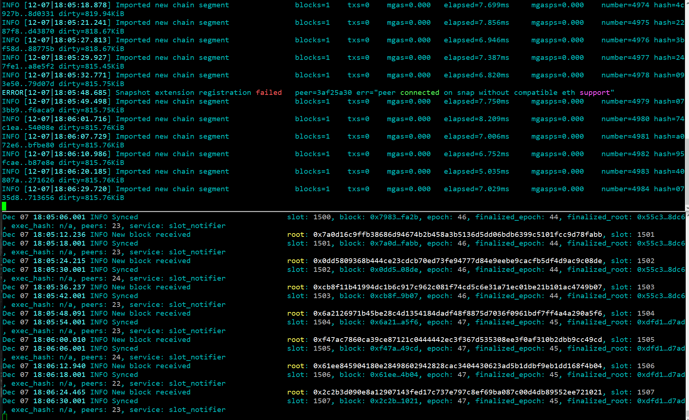
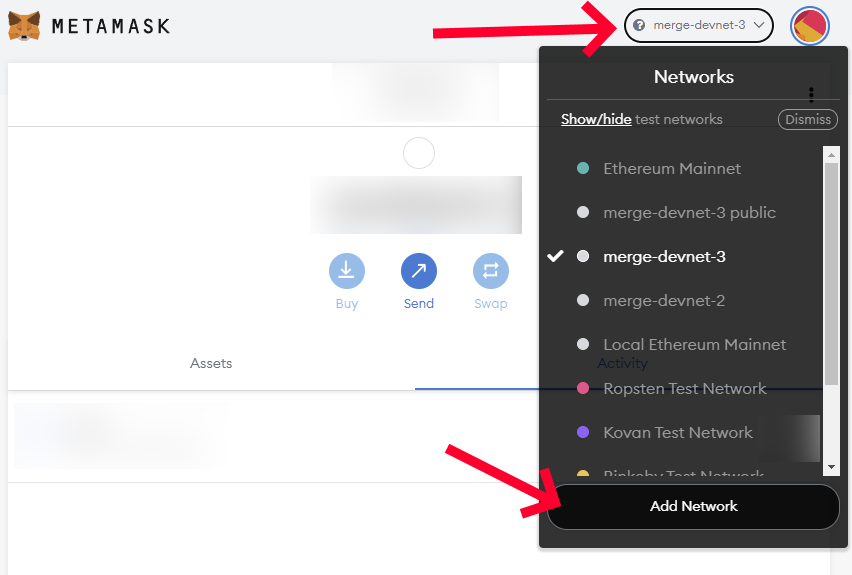
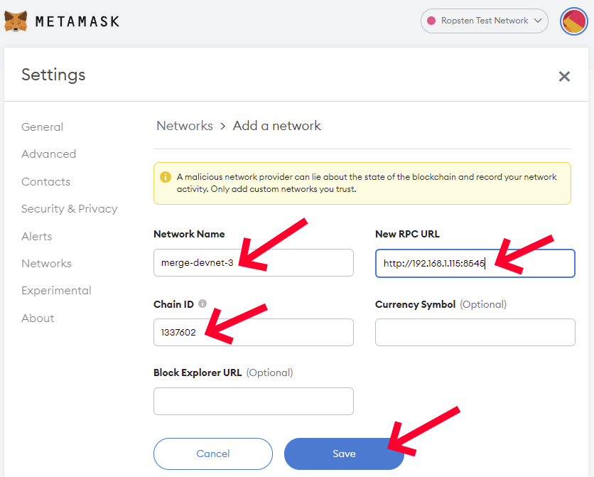

# Guide on how to join the merge-devnet-3

[*#TestingTheMerge*](https://twitter.com/search?q=%23TestingTheMerge) is an Ethereum community initiative to test [the merge upgrade](https://ethereum.org/en/eth2/merge/) with various testnets. It is being spear headed by [Marius van der Wijden](https://twitter.com/vdWijden) and [Parithosh Jayanthi](https://twitter.com/parithosh_j). It is meant to test the recent experimental features added to various Ethereum clients supporting this protocol upgrade.

This guide is meant for people with little or some experience in running Ethereum clients and using the command-line interface (CLI). It will show you step by step how to setup your machine to join the *merge-devnet-3* testnet by giving you the instructions to install and configure all the tools needed. It will assume you are using a modern linux distribution with systemd and APT (like Ubuntu 20.04, but it should work on most recent debian derivatives) on a modern x86 CPU (Intel, AMD). A clean install of your operating system on a dedicated machine or a virtual machine before proceeding is preferable.

The *merge-devnet-3* testnet is likely to be short-lived.

## Overview

We will build special versions of Geth and Lighthouse and we will configure them to connect to the *merge-devnet-3* testnet.

## Executing the commands

Almost all of these commands will be performed in a terminal. Start your *Terminal* application. Any line that starts with the dollar sign (`$`) is a command that need to be executed in your terminal. Do not input the dollar sign (`$`) in your terminal, only the text that comes after that.

Executing a command with `sudo` will occasionally ask you for your password. Make sure to enter your account password correctly. You can execute the command again if you fail to enter the correct password after a few attempts.

## Installing Prerequisites

Make sure we have fully updated packages first.

```console
$ sudo apt -y update
$ sudo apt -y upgrade
```

Install prerequisites commonly available.

```console
$ sudo apt -y install git build-essential cmake wget curl ccze
```

Install a recent version of go.

```console
$ wget https://go.dev/dl/go1.17.4.linux-amd64.tar.gz
$ sudo rm -rf /usr/local/go && sudo tar -C /usr/local -xzf go1.17.4.linux-amd64.tar.gz
$ export PATH=$PATH:/usr/local/go/bin
$ echo 'PATH="$PATH:/usr/local/go/bin"' >> ~/.profile
$ rm go1.17.4.linux-amd64.tar.gz
```

Install a recent version of rust.

```console
$ curl https://sh.rustup.rs -sSf | sh
```

Type `1` and `Enter` to select option 1 *Proceed with installation (default)*.

Add the rust toolchains to your path.

```console
$ source $HOME/.cargo/env
```

## Building and Installing Geth merge-devnet-4

Clone Marius van der Wijden's Geth repository and switch to the `merge-devnet-4` branch.

```console
$ cd ~
$ git clone -b merge-devnet-4 https://github.com/MariusVanDerWijden/go-ethereum.git
```

Build this special Geth version.

```console
$ cd go-ethereum
$ make geth
```

Wait for building to finish and install this special Geth version globally.

```console
$ sudo cp ./build/bin/geth /usr/local/bin
$ cd ~
```

## Building and Installing Lighthouse unstable

Clone the official Lighthouse repository and switch to the `unstable` branch.

```console
$ cd ~
$ git clone -b unstable https://github.com/sigp/lighthouse.git
```

Build this special Lighthouse version.

```console
$ cd lighthouse
$ make
```

Wait for building to finish and install this special Lighthouse version globally.

```console
$ sudo cp ~/.cargo/bin/lighthouse /usr/local/bin
$ cd ~
```

## Obtaining the testnet configuration files

Clone Parithosh Jayanthi's testnet files repository.

```console
$ cd ~
$ git clone https://github.com/parithosh/consensus-deployment-ansible.git
```

## Initializing and configuring your Geth node

Create a dedicated user for running Geth, create a directory for holding the data and assign the proper permissions.

```console
$ sudo useradd --no-create-home --shell /bin/false goeth
$ sudo mkdir -p /var/lib/goethereum
$ sudo chown -R goeth:goeth /var/lib/goethereum
```

Initialize your Geth node with the *merge-devnet-3* genesis file.

```console
$ sudo -u goeth /usr/local/bin/geth \
    init ~/consensus-deployment-ansible/merge-devnet-3/custom_config_data/genesis.json \
    --datadir /var/lib/goethereum
```

Create a systemd service config file to configure the Geth node service.

```console
$ sudo nano /etc/systemd/system/geth.service
```

Paste the following service configuration into the file. Exit and save once done (`Ctrl` + `X`, `Y`, `Enter`).

```ini
[Unit]
Description=Go Ethereum Client - Geth (1337602)
After=network.target
Wants=network.target

[Service]
User=goeth
Group=goeth
Type=simple
Restart=always
RestartSec=5
ExecStart=/usr/local/bin/geth \
    --cache 2048 \
    --syncmode=full \
    --http \
    --datadir /var/lib/goethereum \
    --metrics \
    --metrics.expensive \
    --pprof \
    --networkid=1337602 \
    --catalyst \
    --http.api="engine,eth,web3,net,debug" \
    --http.corsdomain "*" \
    --http.addr "0.0.0.0"

[Install]
WantedBy=default.target
```

Reload systemd to reflect the changes and start the service. Check status to make sure it’s running correctly.

```console
$ sudo systemctl daemon-reload
$ sudo systemctl start geth.service
$ sudo systemctl status geth.service
```

It should say active (running) in green text. If not then go back and repeat the steps to fix the problem. Press Q to quit (will not affect the geth service).

Enable the geth service to automatically start on reboot.

```console
$ sudo systemctl enable geth.service
```

You can watch the live messages from your Geth node logs using this command.

```console
$ sudo journalctl -f -u geth.service -o cat | ccze -A
```

Press `Ctrl` + `C` to stop showing those messages.

## Configuring your Lighthouse beacon node

Create a dedicated user for running the Lighthouse beacon node, create a directory for holding the data, copy testnet files and assign the proper permissions.

```console
$ sudo useradd --no-create-home --shell /bin/false lighthousebeacon
$ sudo mkdir -p /var/lib/lighthouse
$ sudo cp -r ~/consensus-deployment-ansible/merge-devnet-3 /var/lib/lighthouse
$ sudo chown -R lighthousebeacon:lighthousebeacon /var/lib/lighthouse
```

Create a systemd service config file to configure the Geth node service.

```console
$ sudo nano /etc/systemd/system/lighthousebeacon.service
```

Paste the following service configuration into the file. Exit and save once done (`Ctrl` + `X`, `Y`, `Enter`).

```ini
[Unit]
Description=Lighthouse Ethereum Client Beacon Node (merge-devnet-3)
Wants=network-online.target
After=network-online.target

[Service]
Type=simple
User=lighthousebeacon
Group=lighthousebeacon
Restart=always
RestartSec=5
ExecStart=/usr/local/bin/lighthouse bn \
    --spec mainnet \
    --datadir /var/lib/lighthouse \
    --eth1 \
    --http \
    --http-allow-sync-stalled \
    --merge \
    --execution-endpoints http://127.0.0.1:8545 \
    --metrics \
    --boot-nodes="enr:-Iq4QKuNB_wHmWon7hv5HntHiSsyE1a6cUTK1aT7xDSU_hNTLW3R4mowUboCsqYoh1kN9v3ZoSu_WuvW9Aw0tQ0Dxv6GAXxQ7Nv5gmlkgnY0gmlwhLKAlv6Jc2VjcDI1NmsxoQK6S-Cii_KmfFdUJL2TANL3ksaKUnNXvTCv1tLwXs0QgIN1ZHCCIyk" \
    --testnet-dir /var/lib/lighthouse/merge-devnet-3/custom_config_data

[Install]
WantedBy=multi-user.target
```

Reload systemd to reflect the changes and start the service. Check status to make sure it’s running correctly.

```console
$ sudo systemctl daemon-reload
$ sudo systemctl start lighthousebeacon.service
$ sudo systemctl status lighthousebeacon.service
```

It should say active (running) in green text. If not then go back and repeat the steps to fix the problem. Press Q to quit (will not affect the Lighthouse beacon node service).

Enable the Lighthouse beacon node service to automatically start on reboot.

```console
$ sudo systemctl enable lighthousebeacon.service
```

You can watch the live messages from your Lighthouse beacon node logs using this command.

```console
$ sudo journalctl -f -u lighthousebeacon.service -o cat | ccze -A
```

Press `Ctrl` + `C` to stop showing those messages.

## Monitoring your syncing status

If everything went right, you should see similar logs from your Geth node service and your Lighthouse beacon node service.



You can also confirm you are at the head by comparing with [a public blockchain explorer](https://beaconchain.devnet3.themerge.dev/). The latest slot number should match what you see in your Lighthouse beacon node logs.

## Adding merge-testnet-3 to MetaMask

Now that you have a Geth node, you can use it to add the *merge-devnet-3* testnet in your MetaMask networks and try a few transactions. You will need your machine IP address, the one on which you installed and configured your Geth node, to configuration this new network in MetaMask. In the end, you will need the full RPC URL.

* If you are on the same machine (your Geth node is running on the same machine as your browser with the MetaMask extension), use: `localhost`, The RPC URL in that case would be: `http://localhost:8545`.
* If you are on a local network (your Geth node is running on a separate dedicated machine or virtual machine on your local network), use: the IP address of that machine on your local network. You can type `ip address` to find out that IP address. It often starts with `192.168` for machine on your local network. If you see something like `inet 192.168.1.115/24` with that command, it means the IP address is `192.168.1.115`. The RPC URL in that case would be `http://192.168.1.115:8545`.
* If your machine is running remotely on a VPS, in the cloud or some third party hosting, it might be somewhat dangerous to expose the port to your Geth node (8545), but you could configure your firewall to expose it and connect to that public IP address. The RPC URL would be something like: `http://<publicIP>:8545` where `<publicIP>` is replaced with the public IP of your machine.
* If you really don't know how to get that machine IP address, you can use a public endpoint like `https://rpc.devnet3.themerge.dev/`.

In MetaMask, click on network dropdown list and click the `Add Network` button.



Fill out those fields:

Network Name: merge-devnet-3
New RPC URL: The RPC URL to your machine Geth endpoint or a public endpoint (see above on how to find out your RPC URL with your machine IP)
Chain ID: 1337602

And click on the `Save` button.



**TODO**

## Requesting testnet funds

**TODO**

## Performing a simple transaction on merge-testnet-3

**TODO**

## Good references

Check out [the Merge Devnet3 website](https://devnet3.themerge.dev/) for some good references to explorers and faucets.

## Support

If you have any question or if you need additional support, make sure to get in touch with people involved with this initiative:

* EthStaker Discord: [discord.io/ethstaker](https://discord.io/ethstaker) in the #testingthemerge🐼 channel
* Eth R&D Discord: [discord.gg/qGpsxSA](https://discord.gg/qGpsxSA) in the #testing channel under the *Merge* category.

## Credits

Based on [Somer Esat's guide](https://github.com/SomerEsat/ethereum-staking-guide).
Based on [Marius van der Wijden's guide](https://hackmd.io/dFzKxB3ISWO8juUqPpJFfw).