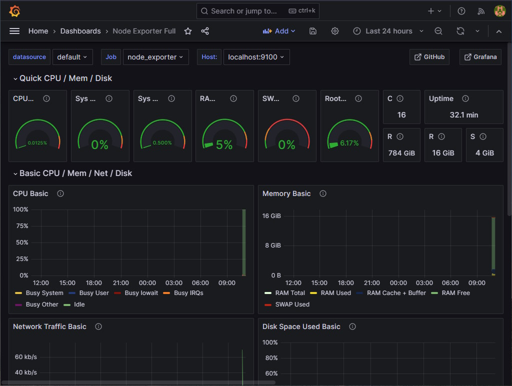

# Guide on how to do monitoring for an Ethereum validator

Monitoring your system resources is an important task for any system administrator using any kind of machine whether you are a professional managing a large data center or simply someone tinkering at home.

This guide is meant for people with no or little experience in monitoring. It will show you step by step how to do monitoring on your machine by giving you the instructions to install and configure all the tools needed. It will assume you are using a modern linux distribution with systemd and APT (like Ubuntu 20.04) on a modern x86 CPU (Intel, AMD).

A video tutorial of this guide can be seen on https://youtu.be/Jkvyd8k_R9Y .

## Why would you want to do monitoring?

Here are some good reasons why you might want to do monitoring on your machine:

1. **Information visibility**: You want to expose and be able to easily see your machine details.
2. **Issue tracking and debugging**: You want to be able to inspect what happened in the past and see clearly how your machine reacted to some event.
3. **Issue prevention**: You want to be able to see potential resources exhaustion ahead of time.

## Overview

We will install 3 tools with this guide: [Prometheus](https://prometheus.io/docs/introduction/overview/), [Node Exporter](https://prometheus.io/docs/guides/node-exporter/) and [Grafana](https://grafana.com/oss/grafana/).

**Prometheus** is an open-source systems monitoring project. It collects and stores different metrics in a specialized database. It provides all those metrics to any other tool who wants to query them in an flexible, efficient and easy way. In our setup, it will collect metrics from Node Exporter and optionally from Ethereum clients and it will provide them on-demand to Grafana.

**Node Exporter** is an open-source project that exposes your hardware and OS metrics. In our setup, it will provide your system metrics to Prometheus.

**Grafana** is a an open-source project used to visualize metrics. It can be used to create dashboards that easily show the metrics you are interested in. In our setup, it will query the metrics stored on Prometheus to show them in a browser with nice charts and diagrams.


## Executing the commands

Almost all of these commands will be performed in a terminal. Start your *Terminal* application. Any line that starts with the dollar sign (`$`) is a command that need to be executed in your terminal. Do not input the dollar sign (`$`) in your terminal, only the text that comes after that.

Executing a command with `sudo` will occasionally ask you for your password. Make sure to enter your account password correctly. You can execute the command again if you fail to enter the correct password after a few attempts.

## Installing Node Exporter

Create a user account for the service to run under. This account will not be able to log into the machine. It will only be used to run the service.

```console
$ sudo useradd --no-create-home --shell /bin/false node_exporter
```

Download the latest stable version of Node Exporter from https://prometheus.io/download/#node_exporter (avoid any pre-release version). As of this date, the latest stable release version is 1.6.0 . Adjust the following instructions accordingly if there is a newer stable release version with a different archive name. The file name should end with *linux-amd64.tar.gz* (for linux and AMD64 instructions set).

```console
$ wget https://github.com/prometheus/node_exporter/releases/download/v1.6.0/node_exporter-1.6.0.linux-amd64.tar.gz
```

Verify that the SHA256 Checksum as shown on https://prometheus.io/download/#node_exporter is the same as the file we just downloaded.

```console
$ sha256sum node_exporter-1.6.0.linux-amd64.tar.gz
```

Extract the archive.

```console
$ tar xvf node_exporter-1.6.0.linux-amd64.tar.gz
```

Copy the binary to the following location and set ownership.

```console
$ sudo cp node_exporter-1.6.0.linux-amd64/node_exporter /usr/local/bin
$ sudo chown -R node_exporter:node_exporter /usr/local/bin/node_exporter
```

Remove the download leftovers.

```console
$ rm -rf node_exporter-1.6.0.linux-amd64
$ rm node_exporter-1.6.0.linux-amd64.tar.gz
```

Create a systemd service file to store the service config which tells systemd to run Node Exporter as the node_exporter user.

```console
$ sudo nano /etc/systemd/system/node_exporter.service
```

Paste the following into the file. Exit and save.

```ini
[Unit]
Description=Node Exporter
Wants=network-online.target
After=network-online.target

[Service]
Type=simple
User=node_exporter
Group=node_exporter
Restart=always
RestartSec=5
ExecStart=/usr/local/bin/node_exporter --web.listen-address="localhost:9100"

[Install]
WantedBy=multi-user.target
```

Reload systemd to reflect the changes.

```console
$ sudo systemctl daemon-reload
```

And then start the service with the following command and check the status to make sure it’s running correctly.

```console
$ sudo systemctl start node_exporter
$ sudo systemctl status node_exporter
```

Output should look something like this.

```
● node_exporter.service - Node Exporter
     Loaded: loaded (/etc/systemd/system/node_exporter.service; disabled; vendo>
     Active: active (running) since Wed 2021-08-04 10:48:25 EDT; 4s ago
   Main PID: 10984 (node_exporter)
      Tasks: 5 (limit: 18440)
     Memory: 2.4M
     CGroup: /system.slice/node_exporter.service
             └─10984 /usr/local/bin/node_exporter

Aug 04 10:48:25 remy-MINIPC-PN50 node_exporter[10984]: level=info ts=2021-08-04>
Aug 04 10:48:25 remy-MINIPC-PN50 node_exporter[10984]: level=info ts=2021-08-04>
Aug 04 10:48:25 remy-MINIPC-PN50 node_exporter[10984]: level=info ts=2021-08-04>
Aug 04 10:48:25 remy-MINIPC-PN50 node_exporter[10984]: level=info ts=2021-08-04>
Aug 04 10:48:25 remy-MINIPC-PN50 node_exporter[10984]: level=info ts=2021-08-04>
Aug 04 10:48:25 remy-MINIPC-PN50 node_exporter[10984]: level=info ts=2021-08-04>
Aug 04 10:48:25 remy-MINIPC-PN50 node_exporter[10984]: level=info ts=2021-08-04>
Aug 04 10:48:25 remy-MINIPC-PN50 node_exporter[10984]: level=info ts=2021-08-04>
Aug 04 10:48:25 remy-MINIPC-PN50 node_exporter[10984]: level=info ts=2021-08-04>
Aug 04 10:48:25 remy-MINIPC-PN50 node_exporter[10984]: level=info ts=2021-08-04>
```

If you did everything right, it should say active (running) in green. If not then go back and repeat the steps to fix the problem. Press Q to quit. Finally, enable Node Exporter to start on boot.

```console
$ sudo systemctl enable node_exporter
```

## Installing Prometheus

Create a user account for the service to run under. This account will not be able to log into the machine. It will only be used to run the service.

```console
$ sudo useradd --no-create-home --shell /bin/false prometheus
```

Create the configuration and data directories with proper ownership.

```console
$ sudo mkdir /etc/prometheus
$ sudo mkdir /var/lib/prometheus
$ sudo chown -R prometheus:prometheus /etc/prometheus
$ sudo chown -R prometheus:prometheus /var/lib/prometheus
```

Download the latest stable version of Prometheus from https://prometheus.io/download/#prometheus (avoid any pre-release version). As of this date, the latest stable release version is 2.44.0 . Adjust the following instructions accordingly if there is a newer stable release version with a different archive name. The file name should end with *linux-amd64.tar.gz* (for linux and AMD64 instructions set).

```console
$ wget https://github.com/prometheus/prometheus/releases/download/v2.44.0/prometheus-2.44.0.linux-amd64.tar.gz
```

Verify that the SHA256 Checksum as shown on https://prometheus.io/download/#prometheus is the same as the file we just downloaded.

```console
$ sha256sum prometheus-2.44.0.linux-amd64.tar.gz
```

Extract the archive.

```console
$ tar xvf prometheus-2.44.0.linux-amd64.tar.gz
```

Copy the binaries to the following locations and set ownership.

```console
$ sudo cp prometheus-2.44.0.linux-amd64/prometheus /usr/local/bin/
$ sudo cp prometheus-2.44.0.linux-amd64/promtool /usr/local/bin/
$ sudo chown -R prometheus:prometheus /usr/local/bin/prometheus
$ sudo chown -R prometheus:prometheus /usr/local/bin/promtool
```

Copy the content files to the following locations and set ownership.

```console
$ sudo cp -r prometheus-2.44.0.linux-amd64/consoles /etc/prometheus
$ sudo cp -r prometheus-2.44.0.linux-amd64/console_libraries /etc/prometheus
$ sudo chown -R prometheus:prometheus /etc/prometheus/consoles
$ sudo chown -R prometheus:prometheus /etc/prometheus/console_libraries
```

Remove the download leftovers.

```console
$ rm -rf prometheus-2.44.0.linux-amd64
$ rm prometheus-2.44.0.linux-amd64.tar.gz
```

Setup the Prometheus configuration file. Open the YAML config file for editing.

```console
$ sudo nano /etc/prometheus/prometheus.yml
```

Paste the following into the file taking care not to make any additional edits. Exit and save the file.

```yaml
global:
  scrape_interval:     15s # Set the scrape interval to every 15 seconds. Default is every 1 minute.
  evaluation_interval: 15s # Evaluate rules every 15 seconds. The default is every 1 minute.

# Alertmanager configuration
alerting:
  alertmanagers:
  - static_configs:
    - targets:
      # - alertmanager:9093
rule_files:
  # - "first_rules.yml"
  # - "second_rules.yml"

scrape_configs:
  - job_name: 'node_exporter'
    static_configs:
      - targets: ['localhost:9100']
```

The `scrape_configs` section define the different jobs where Prometheus will poll data from. We have 1 job so far in this configuration file: *node_exporter*. It will poll data from Node Exporter and it will store all your hardware and OS metrics in its database.

Set ownership for the config file. The prometheus account will own this.

```console
$ sudo chown -R prometheus:prometheus /etc/prometheus/prometheus.yml
```

Finally, let’s test the service is running correctly.

```console
$ sudo -u prometheus /usr/local/bin/prometheus \
    --config.file /etc/prometheus/prometheus.yml \
    --storage.tsdb.path /var/lib/prometheus/ \
    --web.console.templates=/etc/prometheus/consoles \
    --web.console.libraries=/etc/prometheus/console_libraries \
    --web.listen-address="localhost:9090"
```
Output should look something like this. Press `Ctrl` + `C` to exit.

```
level=info ts=2021-08-04T16:18:42.042Z caller=main.go:981 msg="Loading configuration file" filename=/etc/prometheus/prometheus.yml
level=info ts=2021-08-04T16:18:42.042Z caller=main.go:1012 msg="Completed loading of configuration file" filename=/etc/prometheus/prometheus.yml totalDuration=708.063µs remote_storage=3.096µs web_handler=719ns query_engine=1.658µs scrape=94.392µs scrape_sd=59.705µs notify=41.158µs notify_sd=22.063µs rules=2.437µs
level=info ts=2021-08-04T16:18:42.043Z caller=main.go:796 msg="Server is ready to receive web requests."
```

Create a systemd service file to store the service config which tells systemd to run Prometheus as the prometheus user, with the configuration file located in the `/etc/prometheus/prometheus.yml` directory, and to store its data in the `/var/lib/prometheus directory`.

```console
$ sudo nano /etc/systemd/system/prometheus.service
```

Paste the following into the file. Exit and save.

```ini
[Unit]
Description=Prometheus
Wants=network-online.target
After=network-online.target

[Service]
Type=simple
User=prometheus
Group=prometheus
Restart=always
RestartSec=5
ExecStart=/usr/local/bin/prometheus \
    --config.file /etc/prometheus/prometheus.yml \
    --storage.tsdb.path /var/lib/prometheus/ \
    --web.console.templates=/etc/prometheus/consoles \
    --web.console.libraries=/etc/prometheus/console_libraries \
    --web.listen-address="localhost:9090"
ExecReload=/bin/kill -HUP $MAINPID

[Install]
WantedBy=multi-user.target
```

Reload systemd to reflect the changes.

```console
$ sudo systemctl daemon-reload
```

And then start the service with the following command and check the status to make sure it’s running correctly.

```console
$ sudo systemctl start prometheus
$ sudo systemctl status prometheus
```

Output should look something like this.

```
● prometheus.service - Prometheus
     Loaded: loaded (/etc/systemd/system/prometheus.service; disabled; vendor p>
     Active: active (running) since Wed 2021-08-04 12:20:56 EDT; 4s ago
   Main PID: 12061 (prometheus)
      Tasks: 11 (limit: 18440)
     Memory: 19.6M
     CGroup: /system.slice/prometheus.service
             └─12061 /usr/local/bin/prometheus --config.file /etc/prometheus/pr>

Aug 04 12:20:56 remy-MINIPC-PN50 prometheus[12061]: level=info ts=2021-08-04T16>
Aug 04 12:20:56 remy-MINIPC-PN50 prometheus[12061]: level=info ts=2021-08-04T16>
Aug 04 12:20:56 remy-MINIPC-PN50 prometheus[12061]: level=info ts=2021-08-04T16>
Aug 04 12:20:56 remy-MINIPC-PN50 prometheus[12061]: level=info ts=2021-08-04T16>
Aug 04 12:20:56 remy-MINIPC-PN50 prometheus[12061]: level=info ts=2021-08-04T16>
Aug 04 12:20:56 remy-MINIPC-PN50 prometheus[12061]: level=info ts=2021-08-04T16>
Aug 04 12:20:56 remy-MINIPC-PN50 prometheus[12061]: level=info ts=2021-08-04T16>
Aug 04 12:20:56 remy-MINIPC-PN50 prometheus[12061]: level=info ts=2021-08-04T16>
Aug 04 12:20:56 remy-MINIPC-PN50 prometheus[12061]: level=info ts=2021-08-04T16>
Aug 04 12:20:56 remy-MINIPC-PN50 prometheus[12061]: level=info ts=2021-08-04T16>
```

If you did everything right, it should say active (running) in green. If not then go back and repeat the steps to fix the problem. Press Q to quit.
Lastly, enable Prometheus to start on boot.

```console
$ sudo systemctl enable prometheus
```

## Installing Grafana

We will use the [Install from APT repository](https://grafana.com/docs/grafana/latest/installation/debian/#install-from-apt-repository) installation guide from Grafana. A benefit of using this method is that it creates the service for you and it uses APT to easily keep Grafana up-to-date.

Install the prerequisites.

```console
$ sudo apt update -y
$ sudo apt install -y apt-transport-https software-properties-common wget
```

Import the Grafana PGP key.

```console
$ sudo wget -q -O /usr/share/keyrings/grafana.key https://apt.grafana.com/gpg.key
```

Add the Grafana APT repository for stable releases.

```console
$ echo "deb [signed-by=/usr/share/keyrings/grafana.key] https://apt.grafana.com stable main" | sudo tee -a /etc/apt/sources.list.d/grafana.list
```

Install Grafana from the APT repository.

```console
$ sudo apt update
$ sudo apt install grafana
```

Open the Grafana configuration file.

```console
$ sudo nano /etc/grafana/grafana.ini
```

Search for the following section.

```ini
[server]
# Protocol (http, https, h2, socket)
;protocol = http

# The ip address to bind to, empty will bind to all interfaces
;http_addr =
```

Modify the configuration file by removing the semicolon (`;`) in front of `http_addr` and by adding `localhost` after the equal sign (`=`). It should look like this. Exit and save.

```ini
[server]
# Protocol (http, https, h2, socket)
;protocol = http

# The ip address to bind to, empty will bind to all interfaces
http_addr = localhost
```

Reload systemd to reflect the changes.

```console
$ sudo systemctl daemon-reload
```

And then start the service with the following command and check the status to make sure it’s running correctly.

```console
$ sudo systemctl start grafana-server
$ sudo systemctl status grafana-server
```

Output should look something like this.

```
● grafana-server.service - Grafana instance
     Loaded: loaded (/lib/systemd/system/grafana-server.service; disabled; vend>
     Active: active (running) since Wed 2021-08-04 12:59:12 EDT; 4s ago
       Docs: http://docs.grafana.org
   Main PID: 13876 (grafana-server)
      Tasks: 12 (limit: 18440)
     Memory: 31.2M
     CGroup: /system.slice/grafana-server.service
             └─13876 /usr/sbin/grafana-server --config=/etc/grafana/grafana.ini>

Aug 04 12:59:13 remy-MINIPC-PN50 grafana-server[13876]: t=2021-08-04T12:59:13-0>
Aug 04 12:59:13 remy-MINIPC-PN50 grafana-server[13876]: t=2021-08-04T12:59:13-0>
Aug 04 12:59:13 remy-MINIPC-PN50 grafana-server[13876]: t=2021-08-04T12:59:13-0>
Aug 04 12:59:13 remy-MINIPC-PN50 grafana-server[13876]: t=2021-08-04T12:59:13-0>
Aug 04 12:59:13 remy-MINIPC-PN50 grafana-server[13876]: t=2021-08-04T12:59:13-0>
Aug 04 12:59:13 remy-MINIPC-PN50 grafana-server[13876]: t=2021-08-04T12:59:13-0>
Aug 04 12:59:13 remy-MINIPC-PN50 grafana-server[13876]: t=2021-08-04T12:59:13-0>
Aug 04 12:59:13 remy-MINIPC-PN50 grafana-server[13876]: t=2021-08-04T12:59:13-0>
Aug 04 12:59:13 remy-MINIPC-PN50 grafana-server[13876]: t=2021-08-04T12:59:13-0>
Aug 04 12:59:13 remy-MINIPC-PN50 grafana-server[13876]: t=2021-08-04T12:59:13-0>
```

If you did everything right, it should say active (running) in green. If not then go back and repeat the steps to fix the problem. Press Q to quit.
Lastly, enable Grafana to start on boot.

```console
$ sudo systemctl enable grafana-server
```

## Accessing Grafana and adding your dashboards

To connect to Grafana, simply launch a browser from your machine and go to http://localhost:3000 . If you are remotely connecting to your machine with SSH or something else, there are a few security and privacy considerations for which you will need something like an SSH tunnel. Check out the [Remote access to Grafana](#remote-access-to-grafana) section if you are in this situation.

The default credentials for Grafana are:

* **Username**: admin
* **Password**: admin

After your first log in, you will be asked to change the password for the admin account. Make sure to enter a strong and unique password that you will be able to remember. That should bring you to your Grafana home page.


### Adding the Prometheus data source

Grafana has the ability to connect to multiple data sources. We have to add our Prometheus data source before we can use it. In the top left part of the page, click on the hamburger button (☰). Navigate in *Connections* > *Data sources*. Click on the *Add data source* button. Select the *Prometheus* data source type. In the URL field, enter `http://localhost:9090`. Click the *Save and test* button at the bottom of the page. If everything is working, you should see a *Data source is working* message.


### Node Exporter dashboard

A default installation does not include any dashboard. Let's add one for the hardware and OS metrics we are getting from Node Exporter. In the top left part of the page, click on the hamburger button (☰). Navigate in *Dashboards*. Click on the *New* dropdown button and click on *Import*. In the *Import via grafana.com* field, type `1860` and click on the *Load* button. On this next screen, make sure to select the Prometheus datasource from the dropdown list named *Prometheus*. Click on the *Import* button at the bottom.


This will lead you to a nice dashboard showing you a lot of information regarding your machine including CPU, Memory, Network and Disk usage. You can browse the different sections of this dashboard to see more information.



When viewing a dashboard, you will notice a few things:

* You can change everything in your dashboards. Panels can be moved, added, removed or changed to show what you prefer or to show it differently.
* Information is shown for a specific period. In the Node Export dashboard, you will notice a *Last 24 hours* period is selected in a dropdown list in the top right corner. That is your current viewing period which can be changed to your preferences.
* Information can automatically be refreshed. In the Node Export dashboard, you will notice a double circular arrows icon (🔄) with a dropdown button (˅) in the top right part of the page. Using that dropdown button, you can select an automatic refresh delay like *1m* for 1 minute.

You can customize your experience in a lot of different ways. Check out [the Grafana documentation](https://grafana.com/docs/) to learn more about this.

## Adding monitoring for your Ethereum clients

Adding monitoring for your other processes like your Ethereum clients usually requires 3 things:

1. Enabling metrics collection and reporting on your client. This is usually done by adding a few flags to the command line arguments used to start your client and restarting your client service.
2. Configuring Prometheus to poll the metrics from your client. This is done by adding a job in the `scrape_configs` section of the Prometheus configuration file and reloading your Prometheus service.
3. Importing a new dashboard in Grafana to display those metrics. There are many public Grafana dashboards for a lot of different metrics, but sometimes you have to search hard to find one you like.

The following sections will give you the details for each client. Depending on how you installed and configured those clients initially, the exact steps may vary.

### Geth

1. Add or make sure the following flags are included in the command line arguments used to start Geth: `--metrics --metrics.expensive --pprof`. Restart Geth. Make sure Geth is still running properly.
2. Configure Prometheus to poll the metrics from Geth.

Open your Prometheus configuration file.

```console
$ sudo nano /etc/prometheus/prometheus.yml
```

Add the following job in your `scrape_configs` section below all the other jobs. Exit and save.

```yaml
  - job_name: geth
    scrape_timeout: 10s
    metrics_path: /debug/metrics/prometheus
    static_configs:
      - targets: ['localhost:6060']
```

Reload Prometheus with this new configuration file.

```console
$ sudo systemctl reload prometheus.service
```

Check your Prometheus logs to make sure the new configuration file was loaded correctly.

```console
$ sudo journalctl -u prometheus.service -n 6
```

Output should look something like this. Press `q` to exit. Finding the *Completed loading of configuration file* message means your new configuration file was loaded correctly.

```
Aug 09 12:34:05 remy-MINIPC-PN50 systemd[1]: Reloading Prometheus.
Aug 09 12:34:05 remy-MINIPC-PN50 systemd[1]: Reloaded Prometheus.
Aug 09 12:34:05 remy-MINIPC-PN50 prometheus[1934]: level=info ts=2021-08-09T16:34:05.304Z caller=main.go:981 msg="Loading configuration file" filename=/etc/prometheus/prometheus.yml
Aug 09 12:34:05 remy-MINIPC-PN50 prometheus[1934]: level=info ts=2021-08-09T16:34:05.311Z caller=main.go:1012 msg="Completed loading of configuration file" filename=/etc/prometheus/prometheus.yml totalDuration=7.822144ms remote_storage=4.305µs web_handler=6.249µs query_engine=1.734µs scrape=1.831998ms scrape_sd=83.865µs notify=618.619µs notify_sd=51.754µs rules=1.993µs
```
3. Import [a good Geth dashboard for Prometheus](https://raw.githubusercontent.com/eth-educators/ethstaker-guides/main/dashboards/geth-grafana.json) in Grafana.

### Prysm

1. Metrics collection and reporting is enabled by default for Prysm. Nothing to do at this step.
2. Open your Prometheus configuration file.

```console
$ sudo nano /etc/prometheus/prometheus.yml
```

Add the following jobs in your `scrape_configs` section below all the other jobs. Exit and save.

```yaml
  - job_name: prysm_validator
    static_configs:
      - targets: ['localhost:8081']
  - job_name: prysm_beacon
    static_configs:
      - targets: ['localhost:8080']
```

Reload Prometheus with this new configuration file.

```console
$ sudo systemctl reload prometheus.service
```

Check your Prometheus logs to make sure the new configuration file was loaded correctly.

```console
$ sudo journalctl -u prometheus.service -n 6
```

Output should look something like this. Press `q` to exit. Finding the *Completed loading of configuration file* message means your new configuration file was loaded correctly.

```
Aug 09 12:34:05 remy-MINIPC-PN50 systemd[1]: Reloading Prometheus.
Aug 09 12:34:05 remy-MINIPC-PN50 systemd[1]: Reloaded Prometheus.
Aug 09 12:34:05 remy-MINIPC-PN50 prometheus[1934]: level=info ts=2021-08-09T16:34:05.304Z caller=main.go:981 msg="Loading configuration file" filename=/etc/prometheus/prometheus.yml
Aug 09 12:34:05 remy-MINIPC-PN50 prometheus[1934]: level=info ts=2021-08-09T16:34:05.311Z caller=main.go:1012 msg="Completed loading of configuration file" filename=/etc/prometheus/prometheus.yml totalDuration=7.822144ms remote_storage=4.305µs web_handler=6.249µs query_engine=1.734µs scrape=1.831998ms scrape_sd=83.865µs notify=618.619µs notify_sd=51.754µs rules=1.993µs
```
3. Import [the Prysm dashboard for Prometheus](https://docs.prylabs.network/assets/grafana-dashboards/small_amount_validators.json) in Grafana.

### Lighthouse

1. Add or make sure the following flags are included in the command line arguments used to start the Lighthouse Beacon Node: `--validator-monitor-auto --metrics`. Restart the Lighthouse Beacon Node. Make sure the Lighthouse Beacon Node is still running properly.
2. Configure Prometheus to poll the metrics from the Lighthouse Beacon Node.

Open your Prometheus configuration file.

```console
$ sudo nano /etc/prometheus/prometheus.yml
```

Add the following job in your `scrape_configs` section below all the other jobs. Exit and save.

```yaml
  - job_name: lighthouse_beacon
    static_configs:
      - targets: ['localhost:5054']
```

Reload Prometheus with this new configuration file.

```console
$ sudo systemctl reload prometheus.service
```

Check your Prometheus logs to make sure the new configuration file was loaded correctly.

```console
$ sudo journalctl -u prometheus.service -n 6
```

Output should look something like this. Press `q` to exit. Finding the *Completed loading of configuration file* message means your new configuration file was loaded correctly.

```
Aug 09 12:34:05 remy-MINIPC-PN50 systemd[1]: Reloading Prometheus.
Aug 09 12:34:05 remy-MINIPC-PN50 systemd[1]: Reloaded Prometheus.
Aug 09 12:34:05 remy-MINIPC-PN50 prometheus[1934]: level=info ts=2021-08-09T16:34:05.304Z caller=main.go:981 msg="Loading configuration file" filename=/etc/prometheus/prometheus.yml
Aug 09 12:34:05 remy-MINIPC-PN50 prometheus[1934]: level=info ts=2021-08-09T16:34:05.311Z caller=main.go:1012 msg="Completed loading of configuration file" filename=/etc/prometheus/prometheus.yml totalDuration=7.822144ms remote_storage=4.305µs web_handler=6.249µs query_engine=1.734µs scrape=1.831998ms scrape_sd=83.865µs notify=618.619µs notify_sd=51.754µs rules=1.993µs
```
3. Import [the Lighthouse Summary dashboard for Prometheus](https://raw.githubusercontent.com/sigp/lighthouse-metrics/master/dashboards/Summary.json) and [the Lighthouse Validator Monitor dashboard for Prometheus](https://raw.githubusercontent.com/sigp/lighthouse-metrics/master/dashboards/ValidatorMonitor.json) in Grafana.

As an alternative to those official dashboards from the Sigma Prime team, you can try [a port of the Prysm Validator Dashboard for Lighthouse](https://github.com/SeaMonkey82/PrysmDashboardForLighthouse) from the great [Sea Monkey](https://seamonkey.tech/). This dashboard requires a few more instructions and it is assuming more technical knownledge from its users.

### Teku

1. Add or make sure the following flags are included in the command line arguments used to start Teku: `--metrics-enabled`. Restart Teku. Make sure Teku is still running properly.
2. Configure Prometheus to poll the metrics from Teku.

Open your Prometheus configuration file.

```console
$ sudo nano /etc/prometheus/prometheus.yml
```

Add the following job in your `scrape_configs` section below all the other jobs. Exit and save.

```yaml
  - job_name: teku
    scrape_timeout: 10s
    static_configs:
      - targets: ['localhost:8008']
```

Reload Prometheus with this new configuration file.

```console
$ sudo systemctl reload prometheus.service
```

Check your Prometheus logs to make sure the new configuration file was loaded correctly.

```console
$ sudo journalctl -u prometheus.service -n 6
```

Output should look something like this. Press `q` to exit. Finding the *Completed loading of configuration file* message means your new configuration file was loaded correctly.

```
Aug 09 12:34:05 remy-MINIPC-PN50 systemd[1]: Reloading Prometheus.
Aug 09 12:34:05 remy-MINIPC-PN50 systemd[1]: Reloaded Prometheus.
Aug 09 12:34:05 remy-MINIPC-PN50 prometheus[1934]: level=info ts=2021-08-09T16:34:05.304Z caller=main.go:981 msg="Loading configuration file" filename=/etc/prometheus/prometheus.yml
Aug 09 12:34:05 remy-MINIPC-PN50 prometheus[1934]: level=info ts=2021-08-09T16:34:05.311Z caller=main.go:1012 msg="Completed loading of configuration file" filename=/etc/prometheus/prometheus.yml totalDuration=7.822144ms remote_storage=4.305µs web_handler=6.249µs query_engine=1.734µs scrape=1.831998ms scrape_sd=83.865µs notify=618.619µs notify_sd=51.754µs rules=1.993µs
```
3. Import [the Teku dashboard for Prometheus](https://grafana.com/grafana/dashboards/13457) in Grafana.

### Nimbus

1. Add or make sure the following flags are included in the command line arguments used to start the Nimbus Beacon Node: `--metrics`. Restart the Nimbus Beacon Node. Make sure the Nimbus Beacon Node is still running properly.
2. Configure Prometheus to poll the metrics from the Nimbus Beacon Node.

Open your Prometheus configuration file.

```console
$ sudo nano /etc/prometheus/prometheus.yml
```

Add the following job in your `scrape_configs` section below all the other jobs. Exit and save.

```yaml
  - job_name: nimbus
    static_configs:
      - targets: ['localhost:8008']
```

Reload Prometheus with this new configuration file.

```console
$ sudo systemctl reload prometheus.service
```

Check your Prometheus logs to make sure the new configuration file was loaded correctly.

```console
$ sudo journalctl -u prometheus.service -n 6
```

Output should look something like this. Press `q` to exit. Finding the *Completed loading of configuration file* message means your new configuration file was loaded correctly.

```
Aug 09 12:34:05 remy-MINIPC-PN50 systemd[1]: Reloading Prometheus.
Aug 09 12:34:05 remy-MINIPC-PN50 systemd[1]: Reloaded Prometheus.
Aug 09 12:34:05 remy-MINIPC-PN50 prometheus[1934]: level=info ts=2021-08-09T16:34:05.304Z caller=main.go:981 msg="Loading configuration file" filename=/etc/prometheus/prometheus.yml
Aug 09 12:34:05 remy-MINIPC-PN50 prometheus[1934]: level=info ts=2021-08-09T16:34:05.311Z caller=main.go:1012 msg="Completed loading of configuration file" filename=/etc/prometheus/prometheus.yml totalDuration=7.822144ms remote_storage=4.305µs web_handler=6.249µs query_engine=1.734µs scrape=1.831998ms scrape_sd=83.865µs notify=618.619µs notify_sd=51.754µs rules=1.993µs
```
3. Import [the Nimbus dashboard for Prometheus](https://raw.githubusercontent.com/status-im/nimbus-eth2/stable/grafana/beacon_nodes_Grafana_dashboard.json) in Grafana.

## Security risks

Adding Prometheus, Node Exporter and Grafana with this configuration comes with a few additional security risks for your machine.

The first risk comes from the tools themselves. There might be some security issues with them that I am not aware of which might compromise your machine to some malicious actors. A great way to prevent such risk is to keep your system updated. Keeping Grafana updated should be somewhat easy as it was installed with APT. Executing those commands should keep all your system packages updated including Grafana.

```console
$ sudo apt update
$ sudo apt upgrade
```

Keeping Prometheus and Node Exporter updated will require more efforts. You will need to monitor new stable releases and whether they include severe or critical bug fixes. To update to a new version, you will need to download the latest stable release, extract the archive, copy the binaries to their expected location and restart these services. The process and the instructions to download the new version, extract the archive and copy the binaries is exactly the same one mentioned at the beginning of the [Installing Node Exporter](#installing-node-exporter) section and at the beginning of the [Installing Prometheus](#installing-prometheus) section. Easy to use scripts that do all those steps for you are [included below](#prometheus-and-node-exporter-update-scripts).

To restart the Node Exporter service after you updated its binary, use this command.

```console
$ sudo systemctl restart node_exporter
```

To restart the Prometheus service after you updated its binary, use this command.

```console
$ sudo systemctl restart prometheus
```

You can find all the Prometheus releases and their changelog on https://github.com/prometheus/prometheus/releases . You can find all the Node Exporter releases and their changelog on https://github.com/prometheus/node_exporter/releases .

You might never need to update these tools as there might not be any severe or critical issue with them or there might not be an issue that can be easily exploited by a malicious actor with the version you have. However, it's a good practice to monitor releases for the tools you are using and update them regularly.

The second risk comes from the additional attack surface that these tools are creating. One of this attack surface is the HTTP servers they are adding and the ports on which they are listening. This guide configured them to only listen on your localhost interface meaning that they cannot be accessed from any other machine on a network. You would have to have malicious processes or actors connecting to these tools from your machine to access your private data for instance. A good way to prevent this risk is to limit the running processes, run only trusted processes, limit who can connect to the machine and only allow trusted people connecting to your machine.

There might be other kind of risks associated with those tools and this configuration, but I think these two are the main ones.

### Prometheus and Node Exporter update scripts

I created some simple scripts to ease the pain of updating Prometheus and Node Exporter. You can find them in this repository: [update-prometheus.py](scripts/update-prometheus.py) and [update-node-exporter.py](scripts/update-node-exporter.py). Those scripts will check the current installed version and they will compare it with the latest stable release version on Github. If there is a new version available, it will prompt you to update it. Those scripts require a somewhat recent version of Python 3 which should already be installed on your system.

You can easily download those scripts with:

```console
$ wget https://raw.githubusercontent.com/eth-educators/ethstaker-guides/main/scripts/update-prometheus.py
$ wget https://raw.githubusercontent.com/eth-educators/ethstaker-guides/main/scripts/update-node-exporter.py
```

To run the Prometheus update script, use this command:

```console
$ python3 update-prometheus.py
```

To run the Node Exporter update script, use this command:

```console
$ python3 update-node-exporter.py
```

### Remote access to Grafana

If you want to access Grafana and your dashboards from a remote machine on your local network or from the internet, you could simply use [an SSH tunnel](https://www.tunnelsup.com/how-to-create-ssh-tunnels/) ([with PuTTY on Windows](https://www.ibm.com/support/pages/ssh-tunneling-putty) or [natively on Windows 10](http://woshub.com/ssh-tunnel-port-forward-windows/)). There are various other alternatives for remote access that might better suits your needs. A secure HTTPS reverse proxy or a local VPN are possible solutions to this problem but they will be left as an exercise to the reader.

If you are using the main `ssh` CLI client, you can often simply add the following flag and value `-L 3000:127.0.0.1:3000` when connecting to create that SSH tunnel. After doing so, you will be able to connect to http://localhost:3000/ from your client machine, the one you are connecting from, to access Grafana. In the end, it might look like:

```console
$ ssh -L 3000:127.0.0.1:3000 [user@]hostname[:port]
```

## What's next?

You might want to add *alerting* to your setup. If so, check out my other [Guide on how to do alerting for an Ethereum validator](alerting.md).

## Support

If you have any question or if you need additional support, make sure to get in touch with the ethstaker community on:

* Discord: [discord.io/ethstaker](https://discord.io/ethstaker)
* Reddit: [reddit.com/r/ethstaker](https://www.reddit.com/r/ethstaker/)

## Credits

Based on [Somer Esat's guide](https://github.com/SomerEsat/ethereum-staking-guide).
